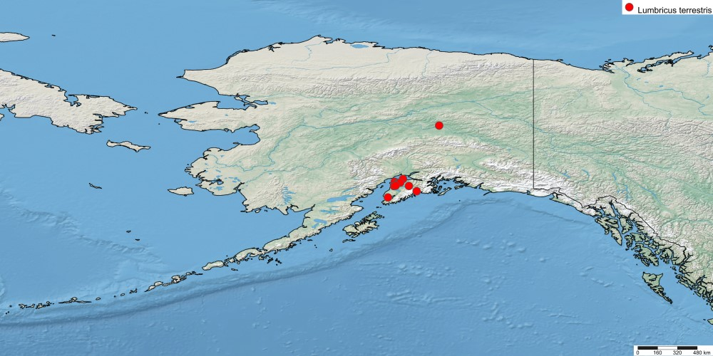

## Monday, January 13

To do:

* Worm information to ADF&G.
* ~~Finish revising and resubmit Slikok manuscript.~~

I finished revising and resubmitted the Slikok manuscript for technical review.

I generated maps of *Lumbricus* species distribution data using SimpleMappr [@shorthouse_david_p_simplemappr_2010] and data from GBIF [@gbiforg_gbif_2020-1;@gbiforg_gbif_2020].

