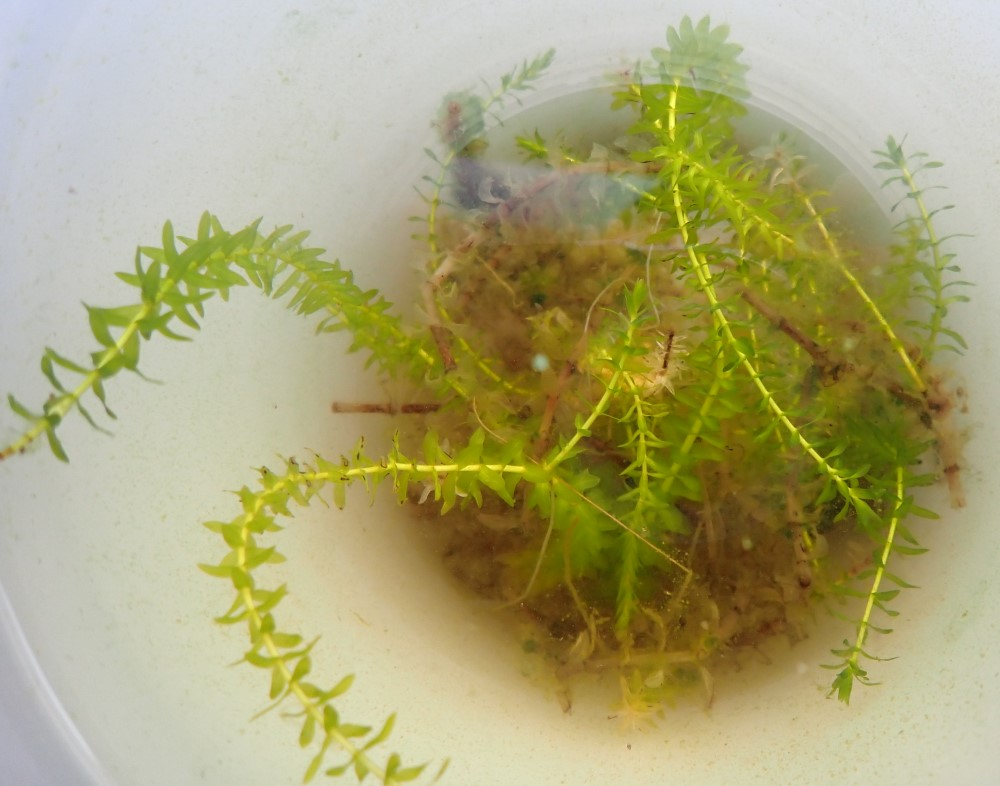

## Friday, January 24

To do:

* ~~Help with Sandpiper Lake *Elodea* RFP, if needed.~~
* Start Sandpiper Lake *Elodea* EA.
* ~~earthworm correspondence.~~
* Take A-110 class.
* *Refuge Notebook* catch-up.

I did a little bit of checklisting work on [KenaiNWRspecies](https://github.com/mlbowser/KenaiNWRspecies).

I attended the a meeting at the ADF&G office on the Miller Creek drainage pike earadication project. Rob Massengill gave me some live elodea that he had collected in Sandpiper Lake and kept alive in a container in his office. I learned that Sandpiper Lake is a popular lake for touch-and-go practice for aircraft from Anchorage.

We submitted the Sandpiper Lake *Elodea* RFP.

Todd and I met with Kristi about Swan Lake Fire suppression repair work beginning next week. I will be going on on Monday and Wednesday.

I entered data for the *Elodea* specimen from Sandpiper Lake in Arctos ([KNWR:Herb:12443](http://arctos.database.museum/guid/KNWR:Herb:12443)). I keyed this using the key of Bowmer [-@bowmer_identification_1995].

\
*Elodea* from Sandpiper Lake, specimen [KNWR:Herb:12443](http://arctos.database.museum/guid/KNWR:Herb:12443).

