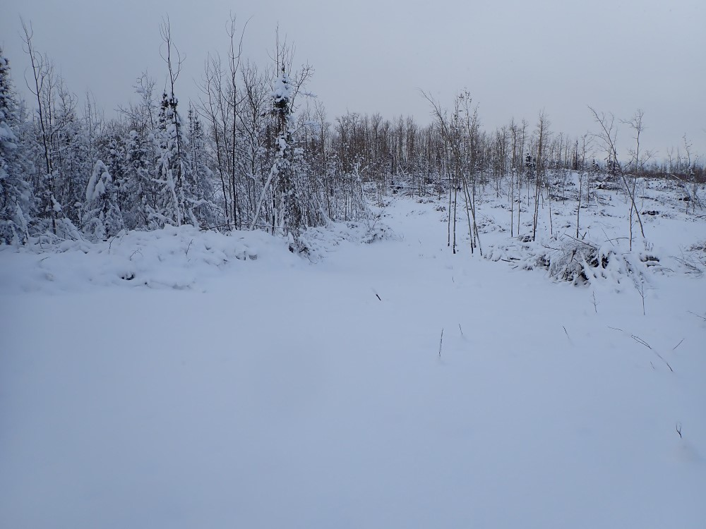
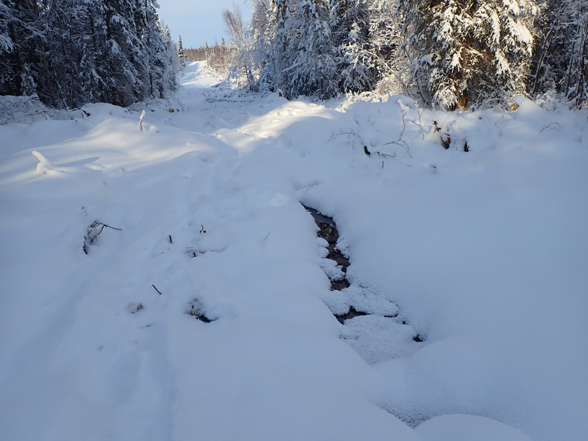
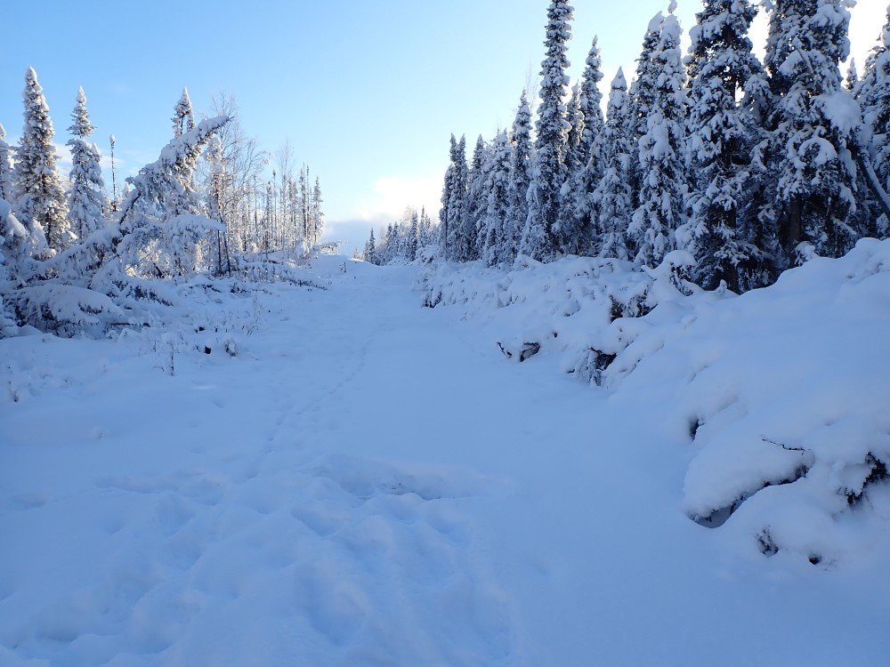

## Monday, January 27

To do:

* Swan Lake Fire Suppression Repair work.

Kyle McNally and I met at the Division of Forestry at 10:00. From there we drove out Skilak Lake Road to the Marsh Lake area dozer line. We walked this line for some distance, sizing up the repair work to be done. Woody debris was stacked on the west side of the line and it looked like it should work well to pull it back over the line with the current snow conditions. We walked only a portion of the line.

\
Marsh Lake area dozer line. Woody material is stacked in a windrow on the left (west) side of the line.

We also hiked the Kenai River to Skilak Road line. The seepage area that had been a difficulty before is still flowing, but Kyle and I thought that equipment should be able to get across this without much damage to the ground because the ground around the seeps appears to be frozen solidly.

\
Seepage area near Kenai River at 60.459053 °N, 150.178570 °W.

Repair work does need to be completed beyond the seepage area.

\
Dozer line in need of repair near Kenai River at 60.457028 °N, 150.175910 °W.

