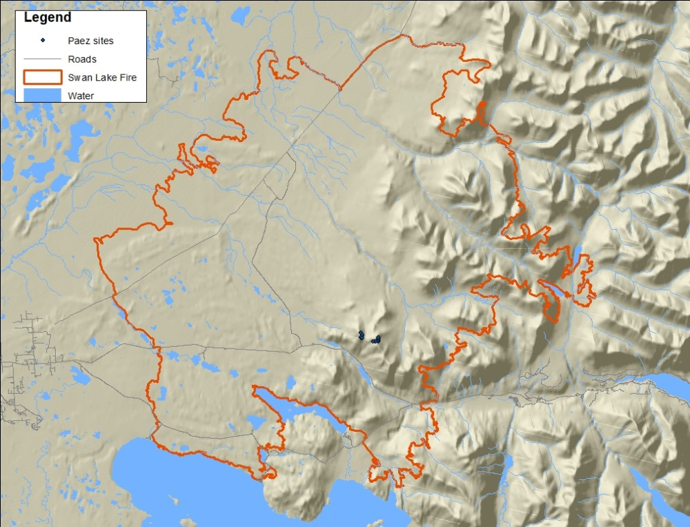

## Friday, January 17

We had a biology staff meeting today, our first since John retired.

Tasks for me:

* Dawn and I need to plan for post-fire burn severity and maybe vegetation sampling within the Swan Lake Fire

* I need to look into elodea genetics to determine the origin of the Sandpiper Lake elodea infestation.

* In the short term I need to get the elodea funding application done and write the *Refuge Notebook* article for next week.

Dawn and I determined that some of the most interesting questions with the Swan Lake fire have to do with burning of alpine tundra and reburning of some locations by multiple fires.

I mapped LTEMP sites within the fire perimeter, looking for alpine tundra sites for which we have pre-fire vegetation data.

* 3161 - tundra north of Mysery Creek. Kenai NWR did veg work.

* 3175 - tundra north side of Mystery Hills. Kenai NWR did veg work.

* 3176 - no photo. Was it ever surveyed? It was sampled by FIA for veg. This looks like subalpine hemlock forest. Plants documented here by FIA: *Pleurozium schreberi*,
*Cornus canadensis*
*Empetrum nigrum*,
*Gymnocarpium dryopteris*,
*Lycopodium annotinum*,
*Lycopodium clavatum*,
*Menziesia ferruginea*,
*Rubus pedatus*,
*Sorbus sitchensis*,
*Trientalis europaea*,
*Tsuga mertensiana*,
*Vaccinium caespitosum*, and
*Vaccinium vitis-idaea*. I checked on Google Earth. This was a hemlock stand on the north slope north of Fuller Lake.

There were really only those two tundra sites within the fire. How about the Paez sites [@paez_alpine_1991]?

I entered the coordinates from the Mystery Hills sites:

plot|utm_e|utm_n
|---:|---:|---:|
62|655073|6713896
63|655073|6714016
64|655039|6713748
79|654989|6713820
80|655089|6713779
81|655003|6714155
102|656300|6713517
103|656290|6713599
138|656294|6713683
139|656303|6713772
140|656033|6713516
141|656108|6713513
142|655901|6713514

I convereted these to lat/lon.

```r
wd <- "D:/projects/Fire/2019_Swan_Lake_Fire/work_space/2020-01-17_plot_coordinates"
setwd(wd)

library(maptools)

wgs84 <- "+proj=longlat +ellps=WGS84 +datum=WGS84 +no_defs"
utmz5n <- "+proj=utm +zone=5 +ellps=WGS84 +datum=WGS84 +units=m +no_defs"

data1 <- read.csv("2020-01-17-1447_Paez_Mystery_Hills_locaclities.csv")
coordinates(data1) <- c("utm_e", "utm_n")
proj4string(data1) <- CRS(utmz5n)
data2 <- spTransform(data1, CRS(wgs84))

write.csv(data2, "2020-01-17-1506_Paez_Mystery_Hills_locaclities_WGS84.csv", row.names=FALSE)

```

plot|lat|lon
|---:|:---|:---|
62|60.53113795|-150.1737958
63|60.53221407|-150.1737019
64|60.52982385|-150.1745303
79|60.53048878|-150.1753839
80|60.53008257|-150.1735961
81|60.53348754|-150.1748672
102|60.52726451|-150.1517647
103|60.52800372|-150.1518821
138|60.52875543|-150.1517431
139|60.52955004|-150.1515091
140|60.52735916|-150.156624
141|60.52730317|-150.1552616
142|60.52739238|-150.1590275

\
Map of the Swan Lake Fire and Carlos Paez's 1988-1989 vegetation plots in the Mystery Hills.

