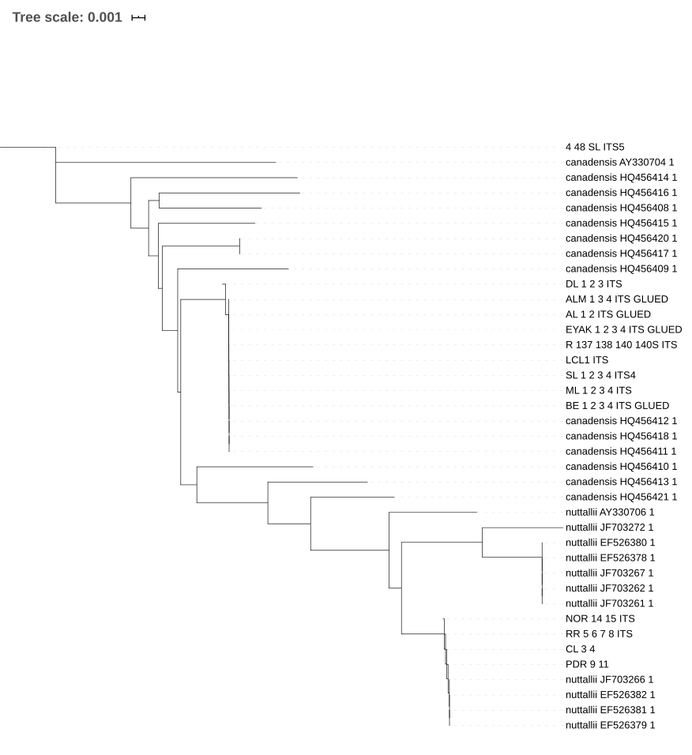

## Tuesday, January 28

To do:

* ~~File pictures, etc. from yesterday.~~
* Sandpiper Lake *Elodea* EA.
* BDJ Slikok manuscript revision.
* ~~*Elodea* genetics correspondence.~~
* ~~Website updates.~~
* Edit this week's *Refuge Notebook* article.

I learned this morning that our Slikok manuscript has been accepted into *Biodiversity Data Journal*. Revisions will need to be completed within one week.

I made some website updates requested by Mark.

I received ITS sequences from Alaska and GenBank *Elodea* samples. I quickly submitted these to NGPhylogeny.fr just to see what the phylogeny would look like. I used the "NGPhylogeny Analyse - FastME/OneClick" analysis [@Desper_2002; @Criscuolo_2010; @Junier_2010; @Katoh_2013; @Lefort_2015; @Lemoine_2018]. This analysis is (temporarily?) available at <https://ngphylogeny.fr/workspace/history/deb556bc487a96e5>.

\
Quick phylogram of *Elodea* sequences made using NGPhylogeny.fr and visualized using iTOL [@Letunic_et_al_2019].

I worked on editing this week's *Refuge Notebook* article.

To avoid going crazy from too much looking at a computer, I examined Anisopodidae specimen [KNWR:Ento:8334](http://arctos.database.museum/guid/KNWR:Ento:8334). Keying using McAlpine et al. [-@mcalpine_manual_1983], p. 311 1 → 2 → *Sylvicola*. Keying using Pratt and Pratt [-@pratt_notes_1980], p. 87 → 1 → 2 *Sylvicola fuscatus* (Fabricius, 1775). This is a female.
