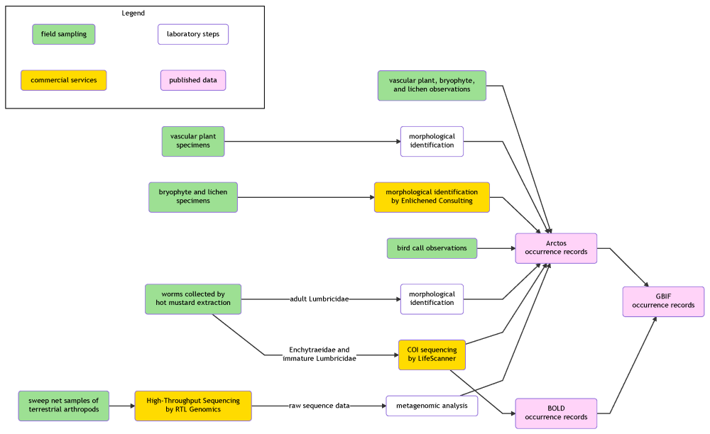

## Thursday, January 30

To do:

* BDJ Slikok manuscript revision.
* Sandpiper Lake *Elodea* EA.

I worked on the BDJ Slikok manuscript revision. I created a flow chart as requested by one of the reviewers.

```r
## Trying DiagrammeR package for making graphs for the Slikok manuscript.
wd <- "D:/projects/Slikok_watershed/data/work_space/2020-01-30_flow_charts"
setwd(wd)

library(DiagrammeR)

mermaid("
graph LR

subgraph Legend
AA(field sampling):::field-->BB(laboratory steps):::knwr
CC(commercial services):::service-->DD(published data):::pub
end

A(vascular plant, bryophyte,<br/>and lichen observations):::field -->C(Arctos<br/>occurrence records):::pub

D(vascular plant<br/>specimens):::field -->E(morphological<br/>identification):::knwr
E-->C

F(bryophyte and lichen<br/>specimens):::field -->G(morphological identification<br/>by Enlichened Consulting):::service
G-->C

H(bird call observations):::field -->C

C-->J(GBIF<br/>occurrence records):::pub

K(worms collected by<br/>hot mustard extraction):::field -- adult Lumbricidae -->M(morphological<br/>identification):::knwr
M-->C

K-- Enchytraeidae and<br/>immature Lumbricidae -->O(COI sequencing<br/>by LifeScanner):::service
O-->C
O-->P(BOLD<br/>occurrence records):::pub
P-->J

Q(sweep net samples of<br/>terrestrial arthropods):::field -->S(High-Throughput Sequencing<br/>by RTL Genomics):::service
S-- raw sequence data -->T(metagenomic analysis):::knwr
T-->C
%% S-- raw sequence data -->U(GenBank<br/>Sequence Read Archive):::pub
%% S-- raw sequence data -->V(Zenodo):::pub

classDef field fill:#9DE093;
classDef knwr fill:#ffffff;
classDef service fill:#FFDB00;
classDef pub fill:#FFD3F8;

style Legend fill:#ffffff,stroke:#000000

linkStyle 0 stroke:#fff,stroke-width:0px;
linkStyle 1 stroke:#fff,stroke-width:0px;

")

```

\
Slikok project flowchart for BDJ manuscript.

I pulled blackfish specimens out of the freezer so that Apphia and I can dissect out stomach contents.

In the afternoon, Apphia and I dissected stomach contents from the larger blackfish that I had collected on August 23, 2019 (field id: 2019-08-23_MLB02) [@bowser_work_2019]. Apphia dissected out the digestive tracts, determined the sex of each fish, and helped with the photographs. I transfered the contents of the stomachs and intestines into vials of propylene glycol by squeezing the contents out using forceps.

temporary ID|total length (mm)|sex
|:---|---:|:---|
2020-01-30_MLB01|69|male
2020-01-30_MLB02|95|female
2020-01-30_MLB03|96|female
2020-01-30_MLB04|75|male
2020-01-30_MLB05|88|female

