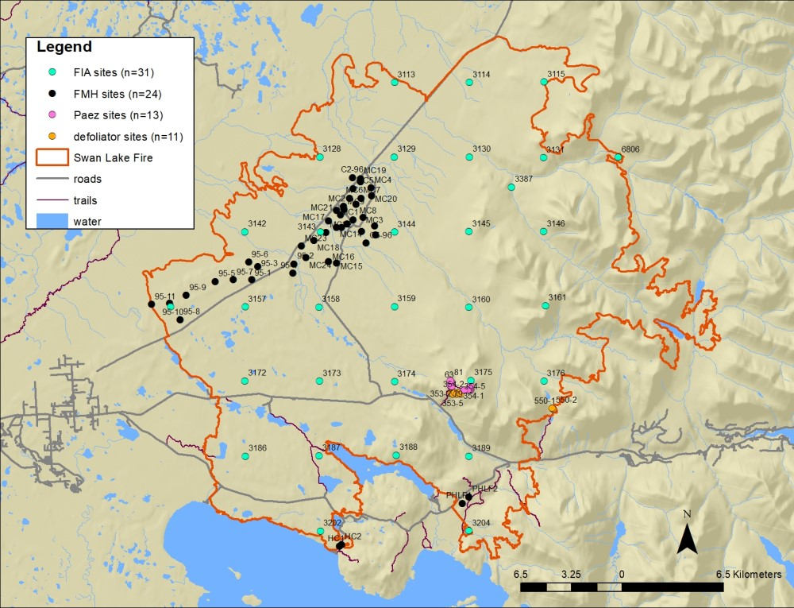

## Thursday, February 26

To do:

* ~~Submit *Refuge Notebook* article.~~
* ~~Board of Fish meeting travel arrangements.~~
* ~~Swan Lake Fire burn severity/vegetation survey planning.~~

I made final edits to this week's Refuge Notebook* article and got it sent off.

Mark asked me to put together data/maps for planning work within the 2019 Swan Lake Fire, so I did.

```r
nm <- read.csv("site_names.csv", stringsAsFactors=FALSE)
loc <- read.csv("2018-06-06-1309_points_wgs84.csv", stringsAsFactors=FALSE)
loc2 <- loc[loc$site_name %in% nm$site_name,]
write.csv(loc2, "2020-02-26-1122_Bowser_sites.csv", row.names=FALSE)

```
\
Map of legacy vegation plots within the Swan Lake Fire.

I started entering plant observation records from Jakubas and Firman [-@jakubas_sandpiper_1984] (records [KNWRObs:Herb:868](http://arctos.database.museum/guid/KNWRObs:Herb:868)–[KNWRObs:Herb:875](http://arctos.database.museum/guid/KNWRObs:Herb:875)).

