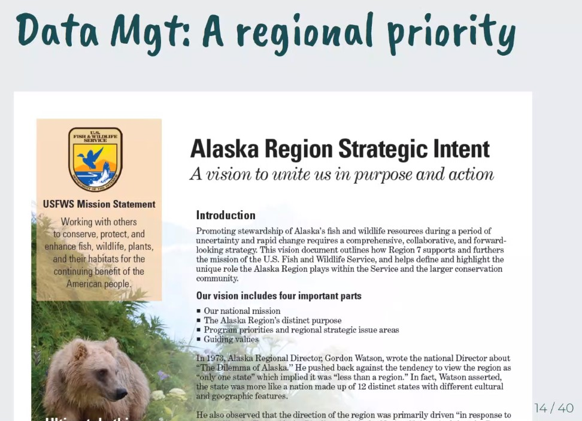

## Friday, February 28

To do:

* ~~Data Management Early Adopter Discussion and [mdEditor](https://www.mdeditor.org/) Training at 10:00~~

Potential projects to use as a test case:

* 2019 black spruce bioinventory
* 2019 Alaska blackfish diet study
* 2020 Sandpiper Lake *Elodea* eradication
* 2020 Swan Lake Fire burn severity and vegetation work

I sorted Berlese sample [KNWR:Ento:11376](http://arctos.database.museum/guid/KNWR:Ento:11376).

Contents:

identification|count
:---|---:
Coleoptera|2
Arachnida|211
Araneae|5
Collembola|24
Cicadellidae|1
Hemiptera|13
Insecta|1

Most of the Hemiptera look like *Arctorthezia*.

Data Management talk/telecon notes/questions:

* Why a new standard for metadata? What already exists? How does it relate to existing standards, e.g. Darwin Core, Dublin Core, RDF (Resource Description Framework)
* Where are these metadata files going?
* Where are the nicely structured project archives going?
* Which laws for sharing data?
  * 1967 FOIA
  * Open Governemnt Data Act
  * Also AK regional strategic intent
* Where is the form for the Regional Data Repository?

* McCrea is my point of contact.

* What is the ISO metadata standard that is being referring to? See <https://ak-region-dst.gitbook.io/alaska-region-mdeditor-interim-user-guide/glossary-of-terms-lcc-metadata-manual#iso>. ISO 19110, ISO 19115-1, ISO 19115-2? Answer: It is based off of ISO 19115-2 or ISO 19115-1, geospatial standards.

\
A slide from the Data Management Early Adopter Discussion.

I entered more observation records from Jakubas and Firman [-@jakubas_sandpiper_1984] (records [KNWRObs:Herb:883](http://arctos.database.museum/guid/KNWRObs:Herb:883)–[KNWRObs:Herb:951](http://arctos.database.museum/guid/KNWRObs:Herb:951)).

I talked with McCrea about which project to use for the data management work. We decided to use the snowshoe hare pellet count survey for this. I am not excited about this because it is a dataset that is not in the best shape and it is not one that I have worked with.

