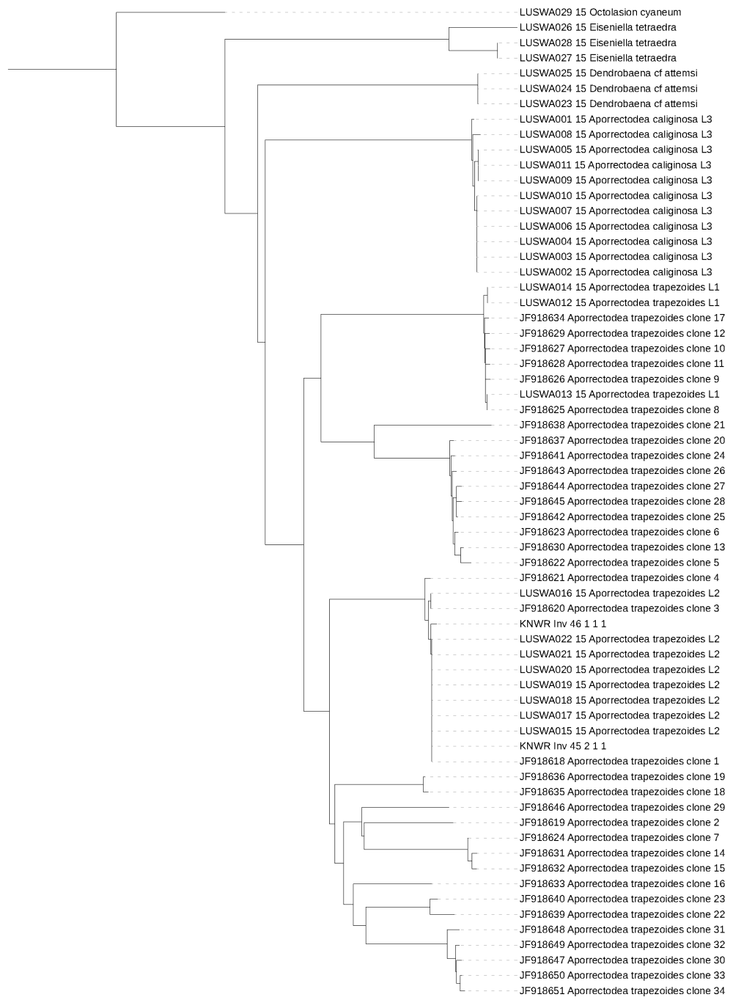

## Thursday, March 12, 2020

To do

* ~~Time sheet.~~
* ~~Get *Refuge Notebook* submitted.~~
* ~~Travel voucher, etc.~~
* Data management telecon.
* ~~Send pesticide applicator card info to Casey.~~
* *Refuge Notebook* scheduling/correspondence.
* Deal with Tyler's earthworms.
* Start 2020 *AKES Newsletter.*

I entered data for the Pilgrim Hot Springs worms ([KNWR:Inv:45](http://arctos.database.museum/guid/KNWR:Inv:45) and [KNWR:Inv:46](http://arctos.database.museum/guid/KNWR:Inv:46)).

```r
wd <- "D:/projects/earthworms/2020-03-12_Pilgrim_Hot_Springs_worms"
setwd(wd)
## Selecting all sequences from Fernández et al. (2011).
acc <- paste0("JF", 918579:918719)
write(acc, "2020-03-12-1032_Fernandez_accns.txt")
```
I submitted this to [Batch Entrez](https://www.ncbi.nlm.nih.gov/sites/batchentrez>)...

```r
wd <- "D:/projects/earthworms/2020-03-12_Pilgrim_Hot_Springs_worms"
setwd(wd)
## Selecting all sequences from Martinsson et al. (2015).
acc <- 101:129
acc <- as.character(acc)
acc <- substr(acc, 2, 3)
acc <- paste0("LUSWA0", acc, "-15")
write(acc, "2020-03-12-1057_Martinsson_seqs.txt")
```
### Data management meeting, 11:00

Question: What kinds of contacts should be added in metadata for a project?

Answer: Anyone involved in the project at any time should be included. The point of contact should always be current.

Action items:

* Add more contacts to the snowshoe hare metadata.
* Organize data into accepted file directory structure.
* Enter three product records, one of which is a raw data file.

```r
## I need to clean up those identifiers.
wd <- "D:/projects/earthworms/2020-03-12_Pilgrim_Hot_Springs_worms"
setwd(wd)
library(Biostrings)

fas1 <- readDNAStringSet("sequence_data/Fernandez_COI.fas")
lab <- names(fas1)
labs <- strsplit(lab, " ")
lab <- paste(
 sapply(labs, "[", 1),
 sapply(labs, "[", 2),
 sapply(labs, "[", 3),
 sapply(labs, "[", 4),
 sapply(labs, "[", 5)
 )
lab <- gsub("\\.1", "", lab)

## Saving.
names(fas1) <- lab
writeXStringSet(fas1, "sequence_data/2020-03-12-1248_Fernandez_COI.fas", format="fasta", width=1000)

## Now for the Martinsson sequences.
fas2 <- readDNAStringSet("sequence_data/Martinsson_COI.fas")
lab <- names(fas2)
labs <- strsplit(lab, "\\|")
lab <- paste(
 sapply(labs, "[", 1),
 sapply(labs, "[", 2)
 )
## Saving.
names(fas2) <- lab
writeXStringSet(fas2, "sequence_data/2020-03-12-1253_Martinsson_COI.fas", format="fasta", width=1000)
```

I put all these sequences together into one FASTA file and I submitted them to NGPhylogeny.fr. I used the "NGPhylogeny Analyse - FastME/OneClick" analysis. This analysis is (temporarily?) available at <https://ngphylogeny.fr/workspace/history/4f38834bbcb8bb64>. I rerooted the tree on iTOL and the tree is available at <https://itol.embl.de/tree/1641591522291071584068995#>.

\
Phylogenetic tree including COI DNA barcode sequences from Fernández et al. [-@fernandez_vagrant_2011], Martinsson et al. [-@martinsson_dna-barcoding_2015], the Pilgrim Hot Springs worms.

It looks like [KNWR:Inv:45](http://arctos.database.museum/guid/KNWR:Inv:45) (2-1-1) is a new clone within *Aporrectodea trapezoides* lineage L2 near clone 1 and [KNWR:Inv:46](http://arctos.database.museum/guid/KNWR:Inv:46) (1-1-1) is *Aporrectodea trapezoides* clone 1.


