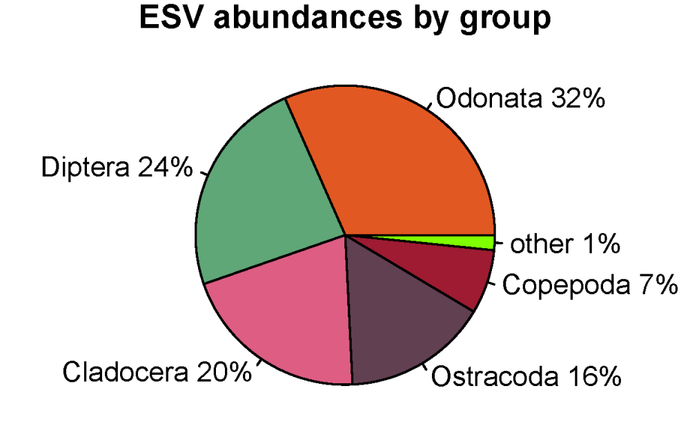

## Monday, March 30

I worked on preparing to upload blackfish diet records to Arctos, getting all the records from the blackfish dataset uploaded to Arctos ([UAMObs:Ento:244406](http://arctos.database.museum/guid/UAMObs:Ento:244406)–[UAMObs:Ento:244542](http://arctos.database.museum/guid/UAMObs:Ento:244542)).

```r
## Continuing to prepare an Arctos upload.
setwd("D:/projects/blackfish/2020_blackfish_diet/2020-03_SCVUC/ml-jg")

load("2020-03-29-0733_workspace.RData")

ad <- read.csv("ArctosData_02FB79E490.csv")

## Joining these and renaming so that I can recycle code from 2019-09-06.
names(ad)[2] <- "guid"
d1 <- merge(r6[r6$accept==1,], ad[c("guid", "COLLECTING_EVENT_ID")], all.x=TRUE)
names(d1)[1] <- "Other_Id_Num_1"
d1$Other_Id_Num_1 <- gsub("KNWRObs:Fish:", "", d1$Other_Id_Num_1)
names(d1)[11] <- "TAXON_NAME"
names(d1)[4] <- "n_reads"
names(d1)[3] <- "otu_id"
names(d1)[13] <- "Identification_Remarks"

## Recycling code from 2019-09-06...
## Sorting.
d1 <- d1[order(d1$Other_Id_Num_1, d1$TAXON_NAME, -d1$n_reads, d1$otu_id),]

d1$Part_Remark_1 <- paste(d1$otu_id, ": ", d1$n_reads, " reads", sep="")

d2 <- aggregate(d1$Part_Remark_1, by=list(d1$TAXON_NAME, d1$Other_Id_Num_1), FUN=paste, sep=" ")

names(d2) <- c("TAXON_NAME", "Other_Id_Num_1", "Part_Remark_1")

d2$Part_Remark_1 <- as.character(d2$Part_Remark_1)
d2$Part_Remark_1 <- as.character(d2$Part_Remark_1)
d2$Part_Remark_1 <- gsub("\"", "", d2$Part_Remark_1)
d2$Part_Remark_1 <- gsub("c\\(", "", d2$Part_Remark_1)
d2$Part_Remark_1 <- gsub("\\)", "", d2$Part_Remark_1)
d2$Part_Remark_1 <- gsub(", ", "", d2$Part_Remark_1)


## Just checking...
sl <- !(d2$Identification_Remarks == "")
d2[sl,]  ## looked pretty good.  There were a couple of places where commas or paranthesis were dropped, but this is ok.

## Adding other field values.
d2$COLLECTION_OBJECT_ID <- 1:nrow(d2)
d2$ENTEREDBY <- "mbowser"
d2$Collector_Agent_1 <- "Matt Bowser"
d2$VERBATIM_DATE <- "August 23, 2019"
d2$BEGAN_DATE <- "2019-08-23"
d2$ENDED_DATE <- "2019-08-23"
d2$COLLECTING_EVENT_ID <- 11449049
d2$COLLECTING_SOURCE <- "wild caught"
d2$ACCN <- "UAM-2020.02-Kenai_blackfish-Ento"
d2$Verbatim_Locality <- "USA: Alaska, Kenai, pond at Candelight Drive and Kenai Spur Highway"
d2$Collector_Role_1 <- "collector"
d2$NATURE_OF_ID <- "molecular"
d2$ID_MADE_BY_AGENT <- "Matt Bowser"

## I remembered to stop before I get too far here and downloaded the current Alaska checklists from Arctos, linked to form http://www.akentsoc.org/the_fauna/checklist. This will enable me to check for new distribution records.

d2$MADE_DATE <- "2020-03-25"
d2$PART_NAME_1 <- "media"
d2$PART_CONDITION_1 <- "not applicable"
d2$PART_LOT_COUNT_1 <- 1
d2$PART_DISPOSITION_1 <- "not applicable"
d2$Other_Id_Num_Type_1 <- "KNWRObs:Fish"
d2$Other_Id_References_1 <- "eaten by"
d2$GUID_PREFIX <- "UAMObs:Ento"
d2$EVENT_ASSIGNED_BY_AGENT <- "Matt Bowser"
d2$EVENT_ASSIGNED_DATE <- "2020-03-30"
d2$SPECIMEN_EVENT_TYPE <- "collection"
d2$COLLECTING_METHOD <- "COI metabarcoding of fish gut contents"

## I need to reformat many of these as Arctos' "A string" format, e.g. "Peltigera {Peltigera conspersa nom. prov.}".
spt <- strsplit(d2$TAXON_NAME, " sp. ")
A <- sapply(spt, "[", 1)
string <- sapply(spt, "[", 2)
sl <- !is.na(string)
d2$TAXON_NAME[sl] <- paste(A[sl], " {", d2$TAXON_NAME[sl], "}", sep="")
levels(as.factor(d2$TAXON_NAME)) ## That looked ok.

## Ok, now trying a record.
write.csv(d2[1,], "2020-03-30-0741_blackfish_Arctos_upload_records_001-001.csv", row.names=FALSE)
## That worked.

## Trying some more.
write.csv(d2[2:10,], "2020-03-30-0949_blackfish_Arctos_upload_records_002-010.csv", row.names=FALSE) ## There were some problems with that one, which I notice before uploading it.

## Fixing.
d2$Part_Remark_1 <- gsub("readsbfdZotu", "reads, bfdZotu", d2$Part_Remark_1)
write.csv(d2[2:10,], "2020-03-30-0949_blackfish_Arctos_upload_records_002-010.csv", row.names=FALSE)
## One record will not load: ; TAXON_NAME (Chironomus bifurcatus) not found.
## This is a relatively newly described species.

## Added it to Arctos (http://arctos.database.museum/name/Chironomus%20bifurcatus) and I requested WUELKER et al. (2009) (https://doi.org/10.11646/zootaxa.2023.1.2) via ILL.

## Trying uploading that last file again.
## That worked.
## Preparing the next file...
write.csv(d2[11:50,], "2020-03-30-1044_blackfish_Arctos_upload_records_011-050.csv", row.names=FALSE)

err <- read.csv("2020-03-30-1049_bulkloader_errors.csv", stringsAsFactors=FALSE)
levels(as.factor(err$LOADED))
[1] ""                                                     
[2] "; TAXON_NAME (Cladopelma bicarinatum) not found"      
[3] "; TAXON_NAME (Hydra utahensis strain AK12b) not found"
[4] "; TAXON_NAME (Lumbriculis) not found"                 
[5] "; TAXON_NAME (Psectrocladius conjungens) not found"   

## One is an easy fix.
d2$TAXON_NAME[d2$TAXON_NAME=="Hydra utahensis strain AK12b"] <- "Hydra utahensis"

d2$TAXON_NAME[d2$TAXON_NAME=="Cladopelma bicarinatum"] <- "Cladopelma bicarinata"

d2$TAXON_NAME <- gsub("Lumbriculis", "Lumbriculus", d2$TAXON_NAME)

## Psectrocladius conjungens is not in Arctos, but a junior synonym, Chaetocladius conjugens, is.

d2$TAXON_NAME <- gsub("Psectrocladius conjungens", "Chaetocladius conjugens", d2$TAXON_NAME)

## Trying again now.
write.csv(d2[11:50,], "2020-03-30-1108_blackfish_Arctos_upload_records_011-050.csv", row.names=FALSE)

## That loaded. I changed the Hydra value in the bulkloader to "Hydra utahensis {Hydra utahensis strain AK12b}".

## Now for the next set.
write.csv(d2[51:100,], "2020-03-30-1113_blackfish_Arctos_upload_records_051-100.csv", row.names=FALSE)
## Now the bulkloader is busy, so that will have to wait.

## Saving here.
save.image("2020-03-30-1116_workspace.RData")

## I can work on graphics/summaries while I wait.

## Summarizing by phyla.
sl <- r7$accept==1
agp <- aggregate(r7$ESVsize[sl], by=list(r7$Phylum[sl]), sum)
agp
     Group.1     x
1   Annelida   384
2 Arthropoda 62166
3   Cnidaria    31
4   Mollusca   160
5   Rotifera   431

names(agp) <- c("phylum", "n_reads")
agp$percent <- agp$n_reads*100/sum(agp$n_reads)
agp <- agp[order(-agp$n_reads),]
agp
      phylum n_reads     percent
2 Arthropoda   62166 98.40752232
5   Rotifera     431  0.68226429
1   Annelida     384  0.60786424
4   Mollusca     160  0.25327677
3   Cnidaria      31  0.04907237

## Wow, 98% arthropods. Now I want to break it into groups at various levels that seem to make sense.

r7$group <- r7$Phylum
sla <- sl & (r7$Phylum=="Arthropoda")
## Summarizing arthrods.
aga <- aga <- aggregate(r7$ESVsize[sla], by=list(r7$Class[sla]), sum)
aga
       Group.1     x
1 Branchiopoda 12934
2  Hexanauplia  4378
3      Insecta 34959
4    Ostracoda  9895

r7$group[(r7$Phylum=="Arthropoda") & (r7$Class=="Ostracoda")] <- "Ostracoda"

## the bulkloader was available, so I got that last set loaded. They loaded just fine.
## Now the rest.
write.csv(d2[101:137,], "2020-03-30-1135_blackfish_Arctos_upload_records_101-137.csv", row.names=FALSE)
## That loaded.

## Back to working toward summaries.
r7$group[(r7$Phylum=="Arthropoda") & (r7$Class=="Insecta")] <- "Insecta"

## Looking at branchiopods.
sl <- r7$Class=="Branchiopoda"
agb <- aggregate(r7$ESVsize[sl], by=list(r7$Order[sl]), sum)
agb
      Group.1     x
1 Diplostraca 13130

## Looking at these. 
sl <- r7$Order=="Diplostraca"
agd <- aggregate(r7$ESVsize[sl], by=list(r7$Family[sl]), sum)
agd
       Group.1     x
1                196
2   Chydoridae   491
3   Daphniidae   118
4 Eurycercidae 12325

## Eurycercidae is a Cladoceran. So is Chydoridae. So is Daphniidae. Calling these all Cladocera.
r7$group[sl] <- "Cladocera"

sl <- r7$Class=="Hexanauplia"
agh <- aggregate(r7$ESVsize[sl], by=list(r7$Order[sl]), sum)
agh
     Group.1    x
1               3
2 Cyclopoida 7099
## We will call these copepods.
r7$group[sl] <- "Copepoda"

sl <- r7$Class=="Insecta"
agh <- aggregate(r7$ESVsize[sl], by=list(r7$Order[sl]), sum)
agh
      Group.1     x
1  Coleoptera    20
2     Diptera 15065
3 Hymenoptera    28
4 Lepidoptera    57
5     Odonata 19967
6 Trichoptera    22

r7$group[r7$Order=="Diptera"] <- "Diptera"
r7$group[r7$Order=="Odonata"] <- "Odonata"
r7$group[r7$group=="Insecta"] <- "orther insects"

## Now looking at the summary.

## Summarizing by phyla.
sl <- r7$accept==1
agg <- aggregate(r7$ESVsize[sl], by=list(r7$group[sl]), sum)
agg

names(agg) <- c("group", "n_reads")
agg$percent <- agg$n_reads*100/sum(agg$n_reads)
agg <- agg[order(-agg$n_reads),]
agg 
            group n_reads     percent
7         Odonata   19967 31.60735769
5         Diptera   14970 23.69720762
2       Cladocera   12934 20.47426075
9       Ostracoda    9895 15.66358513
4        Copepoda    4378  6.93028557
10       Rotifera     431  0.68226429
1        Annelida     384  0.60786424
6        Mollusca     160  0.25327677
3        Cnidaria      31  0.04907237
8  orther insects      22  0.03482556

## now consolidating the rare stuff.
ag2 <- agg[1:6,]
ag2$group[6] <- "other"
ag2$n_reads[6] <- sum(agg$n_reads[6:10])
ag2
       group n_reads    percent
7    Odonata   19967 31.6073577
5    Diptera   14970 23.6972076
2  Cladocera   12934 20.4742607
9  Ostracoda    9895 15.6635851
4   Copepoda    4378  6.9302856
10     other    1028  0.6822643

## A little accounting.
sum(ag2$n_reads)
[1] 63172
sum(r7$ESVsize[r7$accept==1])
[1] 63172
## Good.

## Adding colors.
set.seed(42)
ag2$col <- sample(x=cdf$hex, size=nrow(ag2), replace = FALSE)

pdf(file="2020-03-30-1308_ESV_abundances_by_group.pdf",
 width=5.5,
 height=4
 )
 par(mar=c(0,0,1,0))
 pie(ag2$n_reads, 
  labels = paste0(ag2$group, " ", round(ag2$percent), "%"), 
  main="ESV abundances by group",
  col=ag2$col,
  radius=0.8
  )
dev.off()

pdf(file="2020-03-30-1320_ESV_abundances_by_group.pdf",
 width=4.1,
 height=2.6
 )
 par(mar=c(0,0,1,0))
 pie(ag2$n_reads, 
  labels = paste0(ag2$group, " ", round(ag2$percent), "%"), 
  main="ESV abundances by group",
  col=ag2$col,
  radius=0.8
  )
dev.off()
 
## Checking to see what might have been added to the checklist.
lb <- read.csv("2020-03-30-0700_Arctos_AK_checklist_species_only.csv", stringsAsFactors=FALSE)
la <- read.csv("2020-03-30-1335_Arctos_AK_checklist_species_only.csv", stringsAsFactors=FALSE)
lb <- lb$SCIENTIFIC_NAME
la <- la$SCIENTIFIC_NAME

adds <- setdiff(la, lb)
adds
 [1] "Eurycercus longirostris" 
 [2] "Pleuroxus aduncus"       
 [3] "Simocephalus exspinosus" 
 [4] "Chaetocladius conjugens" 
 [5] "Chironomus bifurcatus"   
 [6] "Cladopelma bicarinata"   
 [7] "Cricotopus trifasciatus" 
 [8] "Dicrotendipes tritomus"  
 [9] "Orthocladius smolandicus"
[10] "Procladius nigriventris" 
[11] "Psectrocladius obvius"   
[12] "Angarotipula illustris"  
[13] "Candona candida"         
[14] "Cypridopsis vidua"    

## Saving this.
write.csv(adds, "2020-03-30-1344_additions.csv", row.names=FALSE)

## Saving here.
save.image("2020-03-30-1345_workspace.RData")
```
\
Pie chart of read numbers of major groups eaten by blackfish.

I worked on reviewing these potential new records.

