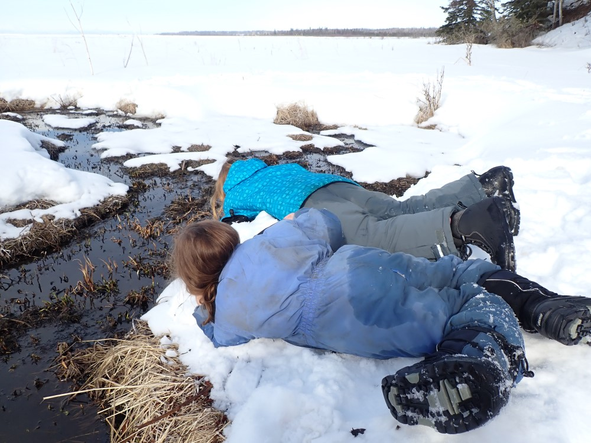

## Saturday, April 4

The kids and I skied, snowshoed, or kicksledded down to a seep by the Kasilof River at 60.365425N, 151.285797W where we collected a worm, some fly larvae, and one caddisfly larva.

\
Collecting invertebrates from a seep near the Kasiof River.

