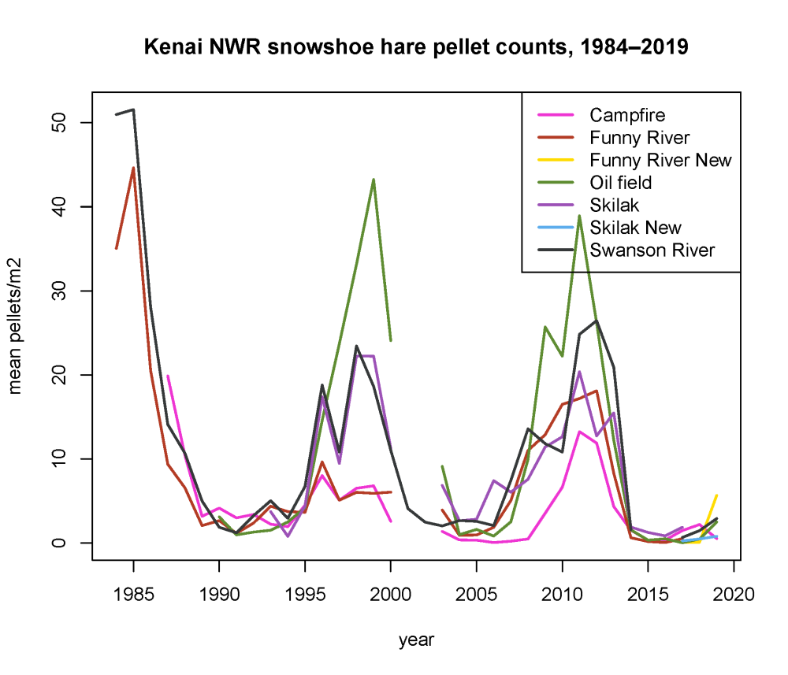

## Wednesday, April 8

To do:

* ~~Edit and submit this week's *Refuge Notebook*.~~
* *Refuge Notebook* catch-up.
* JHAs
* pesticide applicator training.
* ~~Summarize snowshoe hare data?~~

I have the following JHAs to complete.

* pesticide application
* field data collection

I did a little editing of my blackfish article.

I summarized snowshoe hare data.

```r
################################################################################
# Summarize snowshoe hare pellet count data.                                   #
#                                                                              #
# Author: First and last name <matt_bowser@fws.gov>                            #
# Date created: 2020-04-08                                                     #
# Date last edited: 2020-04-08                                                 #
################################################################################


# Setup ------------------------------------------------------------------------

# Load packages
library(reshape2)

# Source external scripts
#source("directory_path/script_foo.R")


# 1 Load data -----------------------------------------------------------------
## ---- load_data  

pellet_data <- read.csv("../data/final_data/observations/2020-03-18_snowshoe_hare_pellet_counts.csv",
 stringsAsFactors=FALSE
 )
 
plot_data <- read.csv("../data/final_data/geodata/2020-03-18_snowshoe_hare_plot_data.csv",
 stringsAsFactors=FALSE
 )


# 2 Prepare data ---------------------------------------------------------------
## ---- prep_data  

## Join the data to get the grid_name values.
pellet_data_joined <- merge(
 plot_data[,c("plot_name", "grid_name")],
 pellet_data
 )

## Convert the plot names to plot numbers.
plot_number <- strsplit(pellet_data_joined$plot_name,
 "-"
 )
plot_number <- sapply(plot_number,
 "[",
 2
 ) 
pellet_data_joined$plot_name <- as.numeric(plot_number)
 
## Reshape the data into a grid_name X plot number X year array.
pellet_data_molten <- melt(pellet_data_joined,
 measure.vars="pellet_count"
 )

pellet_data_array <- acast(
 pellet_data_molten,
 grid_name ~ plot_name ~ year,
 fun.aggregate=sum,
 fill=9999 ## Temporary fill value.
 )
pellet_data_array[pellet_data_array==9999] <- NA
 
n_grids <- dim(pellet_data_array)[1]
n_plots <- dim(pellet_data_array)[2]
n_years <- dim(pellet_data_array)[3]

## Set to NA any plot for which the previous year's count was NA.
for (this_grid in 1:n_grids)
 {
 for (this_plot in 1:n_plots)
  {
  for (this_year in n_years:2)
   if(is.na(pellet_data_array[this_grid,this_plot,this_year-1]))
    {
	pellet_data_array[this_grid,this_plot,this_year] <- NA
	}
  }
 }
 
## Also set all year 1 observations to NA.
pellet_data_array[,,1] <- NA

## Now get averages.
pellet_count_means <- as.data.frame(apply(pellet_data_array,
 c(1,3),
 mean,
 na.rm=TRUE
 ))

## Plot.
plot_title <- paste0("Kenai NWR snowshoe hare pellet counts, ",
 names(pellet_count_means)[2],
 "–",
 names(pellet_count_means)[ncol(pellet_count_means)]
 )

years <- as.numeric(names(pellet_count_means)[2]):as.numeric(names(pellet_count_means)[ncol(pellet_count_means)]) 

## Colors.
grid_colors <- c("#EE34D2",
 "#B33B24",
 "#FFDB00",
 "#5E8C31",
 "#9C51B6",
 "#5DADEC",
 "#353839"
 )

file_name <- paste0("../documents/",
 as.Date(Sys.time()),
 "_pellet_count_means_over_time.pdf"
 )

pdf(file=file_name,
 width=7,
 height=6
 )
plot(x=c(min(years),
 max(years)),
 y=c(0,max(pellet_count_means, na.rm=TRUE)),
 type="n",
 main=plot_title,
 xlab="year",
 ylab="mean pellets/m2"
 )
for (this_grid in 1:n_grids)
 {
 lines(years,
  pellet_count_means[this_grid,2:n_years],
  col=grid_colors[this_grid],
  lwd=2
  )
 }
legend("topright",
 legend = rownames(pellet_count_means),
 col = grid_colors,
 lty=1,
 lwd=2
 )
dev.off()

## Save means summaries.
file_name <- paste0("../documents/",
 as.Date(Sys.time()),
 "_pellet_count_means_over_time.csv"
 )
write.csv(pellet_count_means,
 file_name
 ) 
```

\
Kenai National Wildlife Refuge snoeshoe hare pellet counts, means for each hare grid and year.

I started editing this week's *Refuge Notebook* article.

### Biology staff check-in at 11:00

I finished editing this week's *Refuge Notebook* article and got it sent to the *Clarion*.


