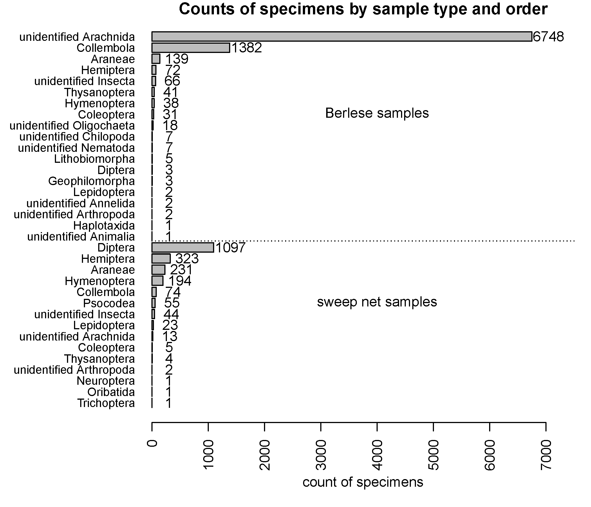

## Wednesday, April 22

To do:

* ~~Ship out Berlese samples.~~
* Compile data from sweep and Berlese samples.
* Slikok occupancy?
* ~~Submit this week's *Refuge Notebook* article.~~
* Review Rob's pike treatment plan.

I did some administrative work on the akentsoc.org website.

I did some more editing of this week's *Refuge Notebook* article and got it sent out.

I drove the Berlese samples to FedEx Kenai and got them shipped out (FedeX tracking number: 813677693827).

I finished entering data from 2019 black spruce project Berlese and soil samples.

```r

## Looking at arthropod sample tally data.

tally_data <- read.csv("../../data/arthropod_samples/sorting_tallies/arthropod_sample_tallies.csv",
 stringsAsFactors=FALSE
 )

dim(tally_data)
[1] 595   4

length(levels(as.factor(tally_data$guid)))
[1] 52

sample_data <- unique(tally_data[,c("guid", "sample_type")])
sample_data

write.csv(sample_data,
 "2020-04-22-1313_sample_data.csv",
 row.names=FALSE
 )


aggregate(sample_data$guid, by=list(sample_data$sample_type), length)
    Group.1  x
1   Berlese 26
2 sweep net 26
## Looks good.

## How many specimens (an understimate due to inability to count clumps of springtails, mites, etc. in soil samples)?
sum(tally_data$count)
[1] 10636

## How many for each method?
aggregate(tally_data$count,
 by=list(tally_data$sample_type),
 sum
 )
    Group.1    x
1   Berlese 8568
2 sweep net 2068

## per sample averages.
aggregate(tally_data$count,
 by=list(tally_data$sample_type),
 sum
 )$x/26
[1] 329.53846  79.53846
 
## Now we need higher taxonomy for summarizing.
identifications <- levels(as.factor(tally_data$identification))
write.csv(identifications,
 "2020-04-22-1318_identifications.csv",
 row.names=FALSE
 )
 
## I edited that in MS Excel.
classification <- read.csv("2020-04-22-1335_classifications.csv",
 stringsAsFactors=FALSE
 ) 

## Putting this together. 
tally_data_wclass <- merge(tally_data,
 classification,
 all.x=TRUE
 )
 
## Saving this.
write.csv(tally_data_wclass, "../../data/arthropod_samples/sorting_tallies/arthropod_sample_tallies.csv",
 row.names=FALSE
 ) 
 
ag_sample_type_order <- aggregate(tally_data_wclass$count,
 by=list(tally_data_wclass$ord,
  tally_data_wclass$sample_type
  ),
 sum
 )

ag_sample_type_order
names(ag_sample_type_order) <- c("ord", "sample_type", "count")

ag_sample_type_order <- ag_sample_type_order[order(ag_sample_type_order$sample_type,
 -ag_sample_type_order$count,
 ag_sample_type_order$ord
 ),]
ag_sample_type_order <- ag_sample_type_order[nrow(ag_sample_type_order):1,]
 
## Now plotting.

pdf(file="2020-04-22-1457_barplot.pdf",
 width=7,
 height=6
 ) 
par(las=2) 
par(mar=c(5,9,1,1)) 
bp <- barplot(ag_sample_type_order$count,
 horiz=TRUE,
 names.arg=ag_sample_type_order$ord,
 cex.names=0.8,
 xlab="count of specimens",
 xlim=c(0,7500),
 main="Counts of specimens by sample type and order"
 ) 
text(ag_sample_type_order$count + 300,
 bp,
 ag_sample_type_order$count
 )
text(rep(4000,2),
 c(mean(c(bp[34], bp[20])), mean(c(bp[19], bp[1]))),
 c("Berlese samples", "sweep net samples")
 )
abline(h=18.2,
 lty="dotted"
 ) 
dev.off()

save.image("2020-04-22-1523_workspace.RData")
```
\
Counts of specimens by sample type and order.