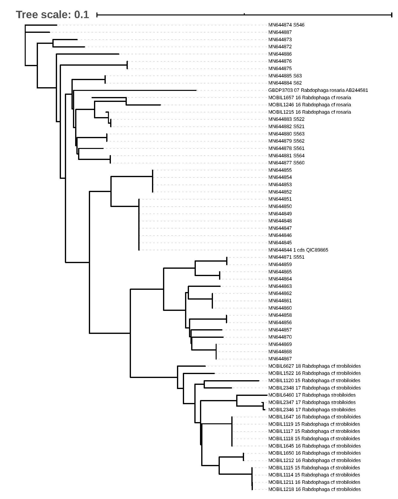

## Friday, April 24

As of this morning that PIPITS analysis is still on the ITSx step.

Yesterday I saw that we have some *Rabdophaga* willow rosette galls on *Salix pulchra* and *Salix fuscescens* in the swamp behind our house. I had been looking for rosette galls on *S. fuscescens* last year because it looked like there might possibly be a difference between COI sequences of *Rabdophaga* gall makers on these two hosts based on previous work [@bowser_dna_2018], but this included only two sequences from *Rabdophaga* on *S. pulchra* and one sequence from *Rabdophaga* on *S. fuscescens*. Sato et al. [-@Sato_et_al_Rabdophaga_2020] did not include any sequences from *Rabdophaga* on *S. fuscescens*.

I downloaded *Rabdophaga* sequences from GenBank with the search string "Sato Rabdophaga" and all *Rabdophaga* sequences from BOLD with the search string "Rabdophaga".

I put these sequences together into one FASTA file and I submitted them to NGPhylogeny.fr. I used the “NGPhylogeny Analyse - FastME/OneClick” analysis. This analysis is available at <https://ngphylogeny.fr/workspace/history/5d1c74c0f1258998>.

### Biology check in meeting at 10:00.

* Acquisition of a MinION may be funded.
* Should try using NGS to look at sheep diet.

That did not include the new sequences from Sato et al. [-@Sato_et_al_Rabdophaga_2020]. Sequence [AB244581](https://www.ncbi.nlm.nih.gov/nuccore/AB244581) was from the *Rabdophaga rosaria* group, though. It was identified as *Rabdophaga strobilina* by Sato and Yukawa [-@sato_resurrection_2006]. This is also in the BOLD dataset.

I tried searching GenBank with the string "Genetic variation in intraspecific populations of Rabdophaga rosaria (Diptera: Cecidomyiidae) indicating possible diversification scenarios into sibling species along with host range expansion on willows (Salicaceae: Salix)". This yielded 44 sequences.

I combined the BOLD and GenBank sequences and submitted them to NGPhylogeny.fr, using the “NGPhylogeny Analyse - FastME/OneClick” analysis. This analysis is available at <https://ngphylogeny.fr/workspace/history/9bcb72e8e1d20fe1>.

It looks like all of our *Rabdophaga* sequences from *S. pulchra* and *S. fuscescens* are *Rabdophaga rosaria* subclade 2B *sensu* Sato et al. [-@Sato_et_al_Rabdophaga_2020].

\
Phylogenetic tree of *Rabdophaga* COI sequences.

