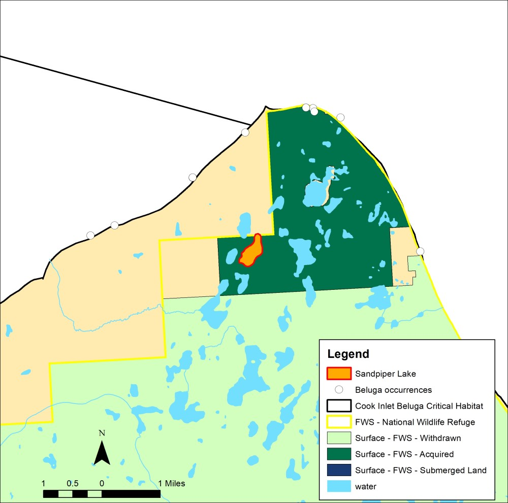
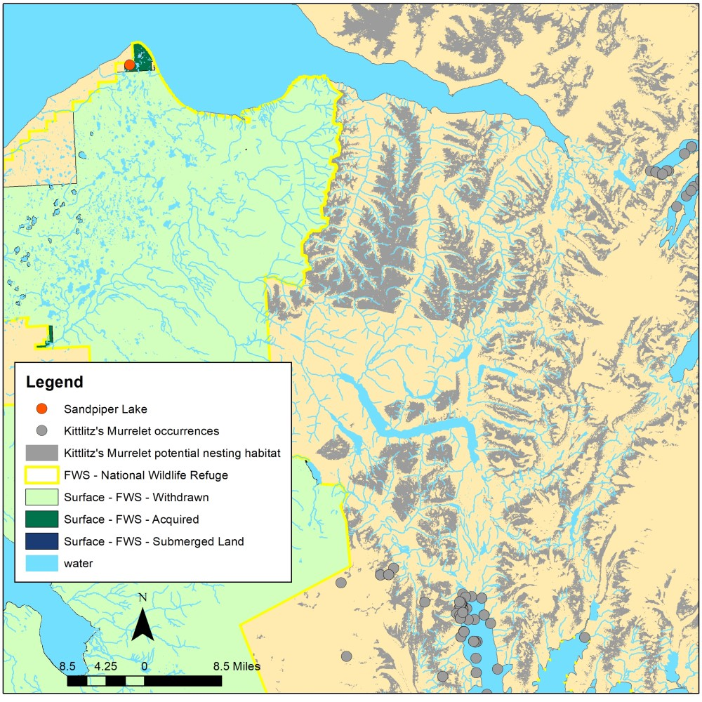

## Monday, May 4

To do:

* Intra-Service Section 7 Biological Evaluation Form

I downloaded Kittlitz's murrelet [@gbiforg_gbif_2020-5] and beluga [@gbiforg_gbif_2020-6] occurrence records from GBIF and worked on mapping these and related data for the Intra-Service Section 7 Biological Evaluation Form.

Sandpiper Lake is 59 km from the nearest occurrence of Kittlitz's murrelet, 19 miles from the nearest potential nesting habitat for Kittlitz's murrelet, 9.4 km from the nearest occurrence of belugas, and 1.4 miles from beluga critical habitat.

\
Map of Cook Inlet Beluga occurrences and Cook Inlet Beluga Critical Habitat in relation to Sandpiper Lake. Occurrence data are from GBIF.org [-@gbiforg_gbif_2020-6] and Critical Habitat areas are from NOAA Fisheries [-@NOAA_beluga_habitat].

\
Map of Kittlitz's Murrelet occurrences and Kittlitz's Murrelet potential nesting habitat in relation to Sandpiper Lake. Occurrence data are from GBIF.org [-@gbiforg_gbif_2020-5] and potential nesting areas are from Felis et al. [-@Felis_et_al_2016].
