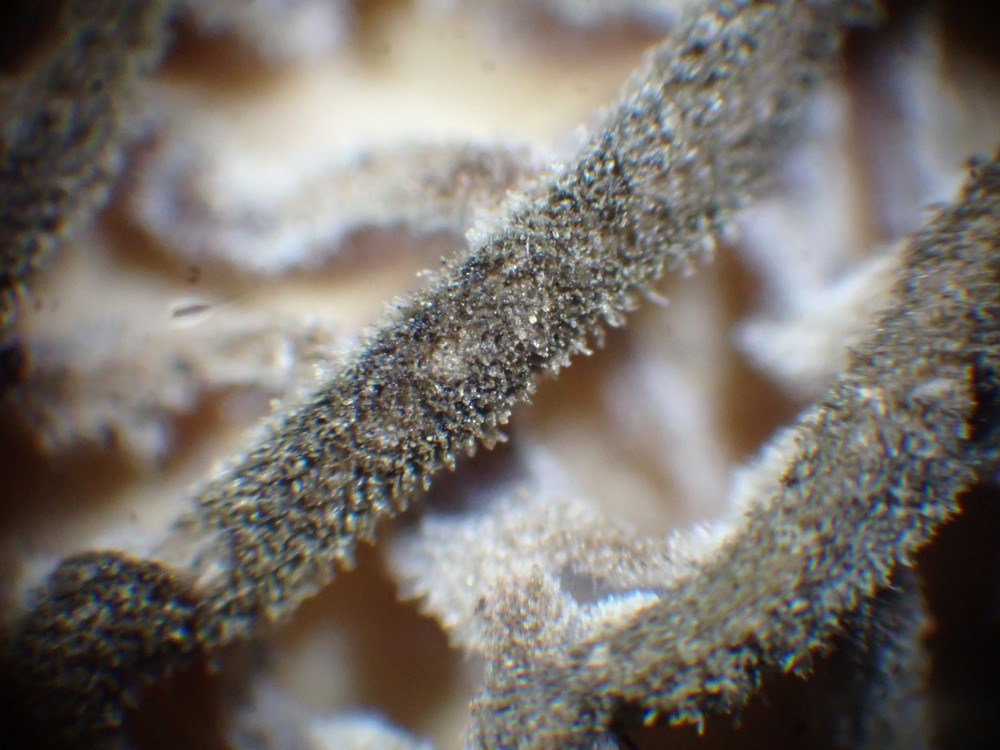

## Tuesday, May 26

To do:

* Write this week's *Refuge Notebook* article.
* Revise aquatic herbicide PUPs.
* Get shortened list of non-native plant species to Amanda.
* Get non-native plant data to AKNHP folks.
* Get burn severity plot data to Lisa.
* Improve Kenai NWR checklist processing/formatting.
* Slikok occupancy.
* Finish 2019 black spruce project.
* Clean up stuff on Yeti.

I started a *Refuge Notebook* article on morels.

Article notes:

There is apparently only a single species of morel identified from the Kenai Peninsula: *Morchella tomentosa* (gray morel) from the Crescent Lake Trail viscinity (iNaturalist: [17941556](https://www.inaturalist.org/observations/17941556)).

I looked through the identifications of fungi from the 2019 black spruce inventory. None of these were *Morchella*.

The unidentified *Morchella* from Interior Alaska in Stefani et al. [-@stefani_morchella_2010] (Herbarium ID: QFB 8581; GenBank accessions: [GQ304982](https://www.ncbi.nlm.nih.gov/nuccore/GQ304982)-[GQ304986](https://www.ncbi.nlm.nih.gov/nuccore/GQ304986)) appears to be *Morchella exuberans* based on NCBI BLAST searches. Like *Morchella tomentosa*, this is another post-fire species [@richard_true_2015].

I was unable to revise the aquatic herbicide PUPs. They appear to be locked.

I examined the morels that Colin had collected on May 19. Three had dark ridges that were not tomentose; a fourth appeared to be *Morchella tomentosa*.

\
Detail of tomentose ridges of a morel specimen with iNaturalist observation ID [47411794](https://www.inaturalist.org/observations/47411794), apparently *Morchella tomentosa*.
