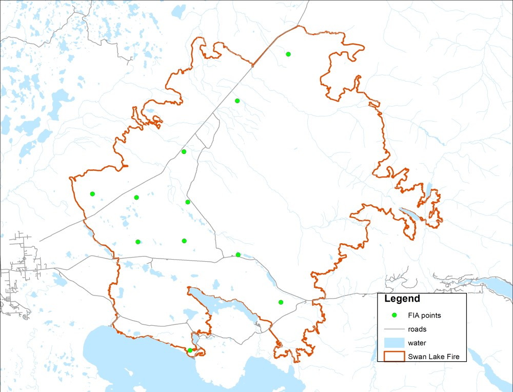

## Thursday, May 28

To do:

* ~~Submit this week's *Refuge Notebook* article.~~
* Revise aquatic herbicide PUPs.
* Get non-native plant data to AKNHP folks.
* ~~Get burn severity plot data to Lisa.~~
* Improve Kenai NWR checklist processing/formatting.
* Slikok occupancy.
* Finish 2019 black spruce project.
* Clean up stuff on Yeti.

I finished revising and submitted my *Refuge Notebook* article on morels this morning.

I mapped FIA points within the Swan Lake fire and near roads for Lisa.

\
Map of FIA points that are within the Swan Lake Fire perimeter and that are within 1 mile from roads.

