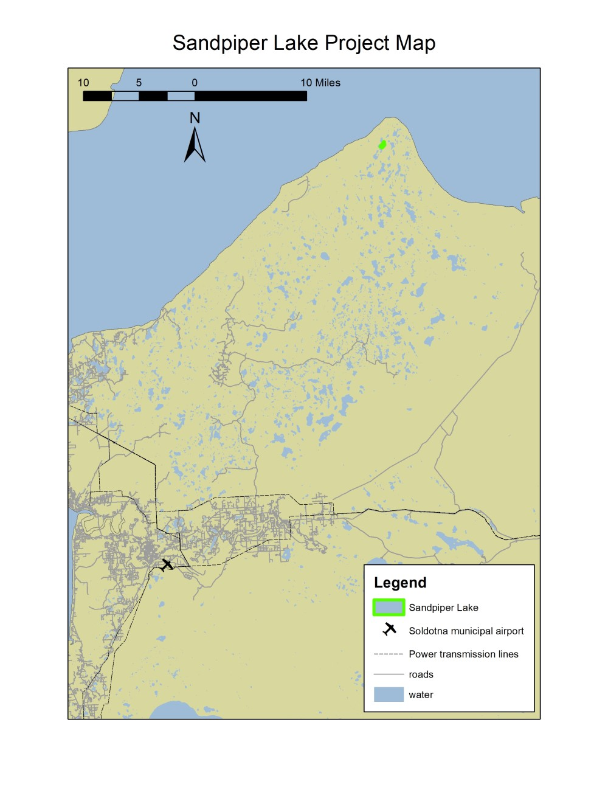

## Monday, June 8

To do:

* Fill out a USFWS Alaska Region 2020 field project go/no go screening matrix and individual project safety plan for the Sandpiper Lake elodea eradication project. 
* *Refuge Notebook* catch-up.
* Revise aquatic herbicide PUPs.
* Improve Kenai NWR checklist processing/formatting.
* Publish LTEMP bird and plant data.
* Slikok occupancy.
* Finish 2019 black spruce project.

I made a map for the Sandpiper Lake Project Aviation Safety Plan.

\
Sandpiper Lake elodea eradication project aviation map.

### 11:00 Biology staff meeting

Steve Swenson tentatively identified the Marsh Lake Trail caterpillars as *Sunira verberata* and sent me photos from the Richardson Highway on cottonwoods in 2017. There were an outbreaks of this species in Alaska in the 2000s and in 2017 [@usda_forest_service_alaska_region_forest_2005; @usda_forest_service_alaska_region_forest_2006; @usda_forest_service_alaska_region_forest_2007; @usda_forest_service_alaska_region_forest_2008; @fs-r10-fhp_forest_2018]. I had collected this species on June 10, 2017 on the Fuller Lakes Trail (iNaturalist: [6586033](https://www.inaturalist.org/observations/6586033), BOLD: [MOBIL6501-18](http://boldsystems.org/index.php/Public_RecordView?processid=MOBIL6501-18)), where I had noted that these were numerous.

