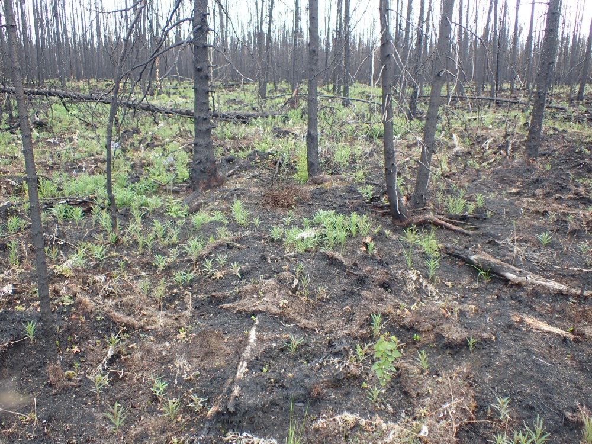

## Friday, June 12

I arrived early to get things together for today.

Mark, Amanda, Jake, and I hauled a UTV out to Adkins Road, then took the UTV down the pipeline, continuing with weed survey work that they had begun earlier. 

Our first stop was at a gated valve on the pipeline at 60.57667 °N, 150.471202 °W. Here we just saw *Taraxacum officinale*, *Trifolium*, and other common weeds of trails and roads.

Our next stop was at DP-100 at 60.5848 °N, 150.444657 °W. This was quite clean. The only non-native plant we saw here was *Taraxacum officinale*. 

The vegetation response has looked quite nice along this pipeline. Most of the woods have burned with moderate severity and already aspens, willows, and fireweed are resprouting. It looks like these will be mostly aspen woods soon.

\
Burned woods at DP-100.

Here I collected aphids from *Salix bebbiana* → vial BOLD-PB6. 

We stopped next at H-35 at 60.588818 °N, 150.430852 °W. Here were just *Taraxacum officinale*, *Plantago major*, and *Matricaria discoidea*.

Our next stop was DP-110 at 60.597067 °N, 150.395643 °W. There was what I believe is *Leucanthemum vulgare* here, but it was immature. Near here I collected one morel with root-like structures (2020-06-12-MLB01).

Observations from the day are available at <https://www.inaturalist.org/calendar/mbowser/2020/6/12>. 
