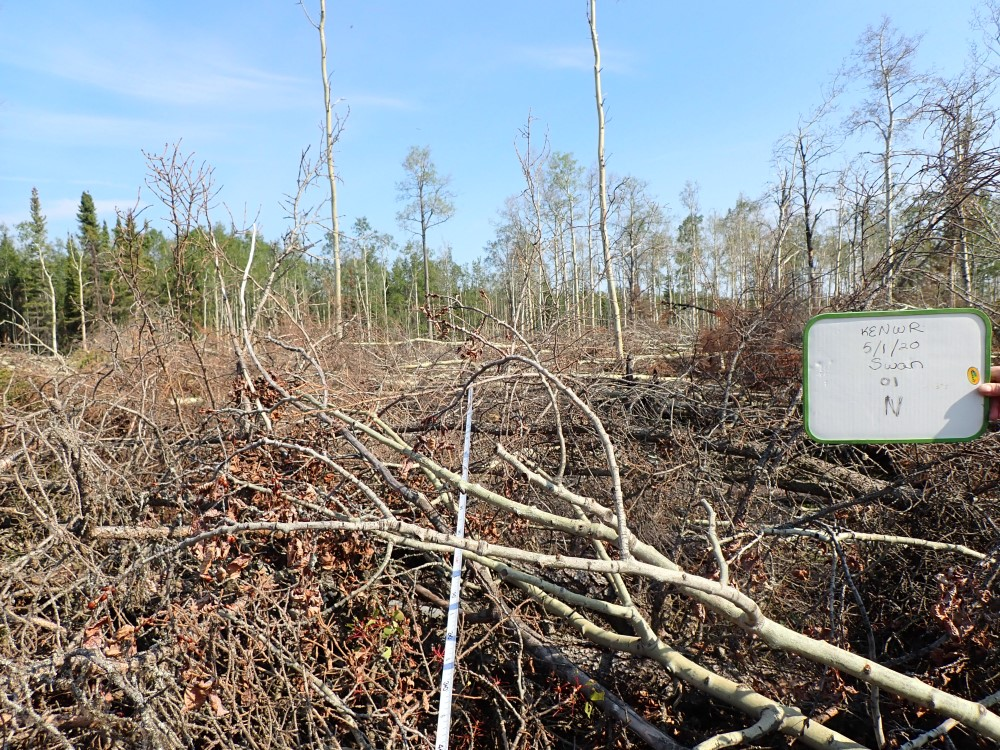
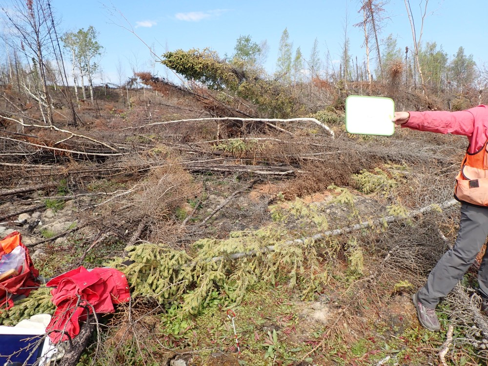

## Wednesday, July 1

<!-- 07:00-17:30 -->

Mark, Dawn, Lisa Saperstein, and I drove out to the west entrance of Skilak Lake Road so that Lisa could train us on Composite Burn Index (CBI) and related plot methods. We followed the protocol and datasheets of Hrobak and Barnes [-@hrobak_standard_2020].

Our first plot, KE-SWAN-01, was near the Marsh Lake Trail on the north side of the road. This was in an aspen stand with some black spruce. It has been burned quite severely so that no aspen suckers were coming up. *Marchantia polymorpha*, *Ceratodon purpureus*, and fireweed covered much of the mineral soil. Most of the trees had fallen down due to burned-out roots. We saw one black spruce seedling, but no other tree or shrub recruitment.

\
Burn severity sampling site KE-SWAN-01, looking north from plot center.

Our second plot, KE-SWAN-05, was off of the road to Lower Skilak Campground. This was in a wet black spruce stand with some birch. This had been burned pretty severely, removing much of the organic soil and burning out almost all tree roots, but the organic soil here was deep and damp so that the lower layers remained. Some willows were coming back here.

\
Burn severity sampling site KE-SWAN-05, looking north from plot center.
