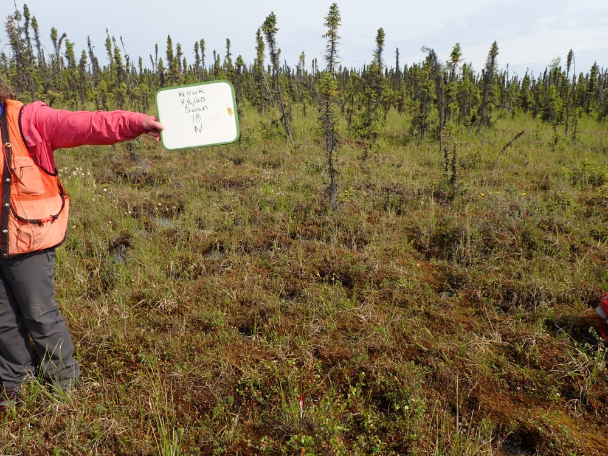
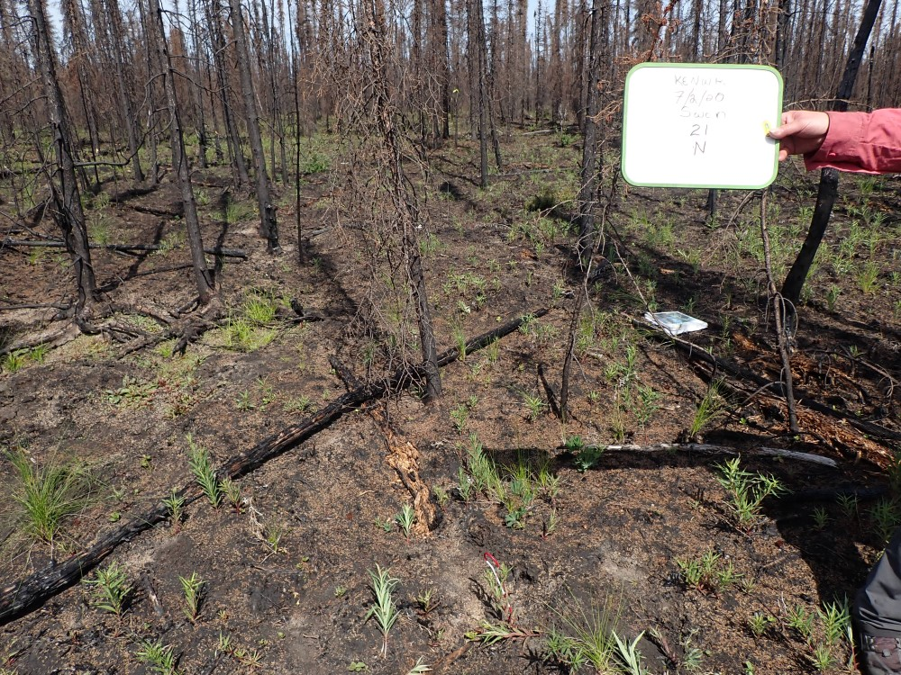

## Thursday, July 2

<!-- 06:45-17:00 -->

I came in early to take care of notes, charge batteries, etc.

I spent the day off of the Sterling Highway and Mystery Creek with Lisa, Dawn, and Amanda. We worked on more combined burn index plot training.

Our first plot was FE-SWAN-18 northeast of Egumen Lake. This ended up being unburned black spruce swamp. 

\
Burn severity sampling site KE-SWAN-18, looking north from plot center.

On the way back to the truck we found some orchids that were unfamiliar to me. Back at the office I identified these as *Galearis rotundifolia* (iNaturalist: [51766406](https://www.inaturalist.org/observations/51766406)).

We had lunch at Picnic Lake. There were lots of bryozoans under the rocks in the water.

Our next plot was KE-SWAN-21 east of Picnic Lake. This was black spruce forest that was a bit more moderately burned than what we had looked at yesterday. More duff remained and more plants were resprouting.

\
Burn severity sampling site KE-SWAN-21, looking north from plot center.

Our last plot for the day was KE-SWAN-19 near the south end of Mystery Creek Road. This was again in well-drained black spruce forest, but this had been even more moderatly burned, with many willows, some aspen, and many *Betula glandulosa* resprouting. We did not have time to complete the CBI protocols here; we just looked at it before leaving the field.

