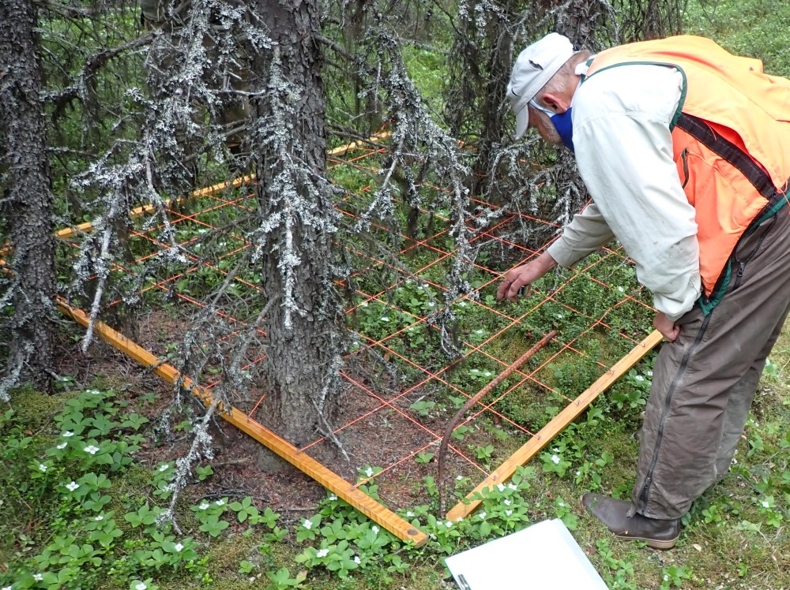

## Monday, July 6

<!-- 08:00-16:40 -->

I printed off datasheets and otherwise prepared for field work today.

Ed, Sarah, Jake, and I visited Hakala plot HAK 1 south of the radio tower at the west border of the Refuge off of the Sterling Highway. At the plot we first took photographs from just outside of the plot looking into the plot from the north and south. Next, we set up the first milacre plot and tallied all plant species. For dense species like *Vaccinium vitis-idaea* we made quick visual tallies. Grasses were counted as clumps. We also took diameter at breast height measurements of all trees.

\
Ed tallying *Vaccinium vitis-idaea* on Hakala plot 1, milacre 1.

Jake and I left after finishing the seventh milacre plot.
