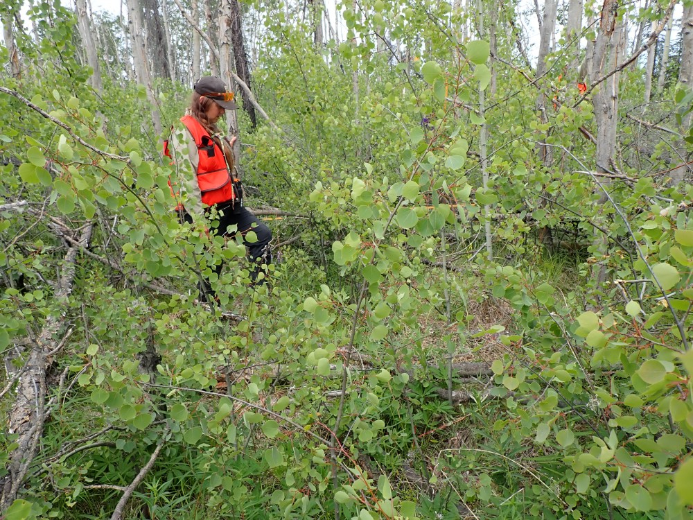

## Tuesday, July 7

<!-- 07:15-16:45 -->

I saw two snowshoe hares along the Sterling Highway east of Sterling near the east entrance of Skilak Lake Road. They are definitely becoming more abundant.

I joined Ed and Sarah at plot HAK2. They were on milacre 2 when I arrived. This plot has extensive layering of black spruce, which may become separate trees. Ed explained that he keeps a separate tally of layering to avoid anomalies in the tree numbers. 

\
Hakala plot 2, milacre 2.

Ed pointed out a lichen, *Leptogium saturninum*, growing on aspen (iNaturalist: [52283404](https://www.inaturalist.org/observations/52283404)). This was a species that I did not know.

After completing HAK2 we drove east down the road to HAK3, an aspen stand which had been lightly burned in the 2015 Card Street Fire. Now the aspens have fallen in all directions in this area, making getting around quite difficult. We only located a subset of the stakes. We decided to return to this one later. I obtained a GPS averaged location for the south end of the plot. This was at 60.49992 °N, 150.49989 °W with a GPS averaged accuracy of 1 m.

\
Part of Hakala plot 3.

On the way back to the truck I looked for noctuid pupae in the leaf litter. I found one living, but apparently dehyrdrated larva that looked like *Sunira verberata* (iNaturalist: [52380873](https://www.inaturalist.org/observations/52380873)). I found no pupae. I collected this (vial BOLD-QK7).

We drove further east to HAK4, which had been burned in the Swan Lake Fire. This was severely burned, which downed black spruce and aspen all over and *Marchantia* and fireweed populating it. Dawn filled out a CBI datasheet here. I left just as we were getting started on this plot.

\
Hakala plot 4 photographed looking south over the north end of the plot.

I photographed and collected a gray morel, *Morchella tomentosa* in the vicinity of the plot (iNaturalist: [52382438](https://www.inaturalist.org/observations/52382438)). A spruce seedling was growing by the morel. I had noticed no seedlings in the plot.
