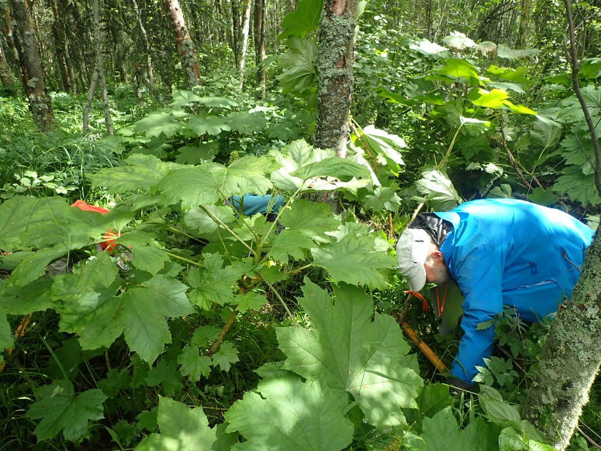

## Thursday, July 9

<!-- 08:00-17:30 -->

I met Ed and Sarah at Hakala plot HAK5, which had burned in the Swan Lake Fire. There were too many downed trees for us to safely work here, so we proceeded to HAK6.

\
Vicinity of plot HAK5. Photo by Ed Berg.

Dawn joined us at HAK6. This was a beautiful, lush site under birches and *Alnus incana*.

\
Surveying part of Hakala plot HAK6.

The alders were extensively damaged by green sawfly larvae that must be <i>Monsoma pulveratum</i> (iNaturalist: [52964721](https://www.inaturalist.org/observations/52964721)).

\
*Monsoma pulveratum* larva on *Alnus incana*.
