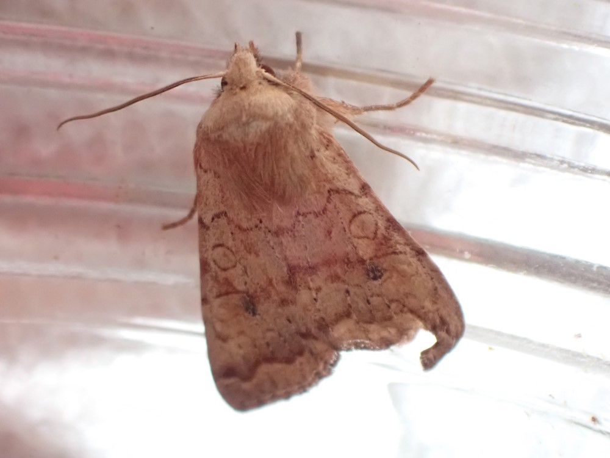

## Sunday, July 12

An adult moth had emerged in each of the two jars of caterpillars collected from Marsh Lake Trail on June 3. Both appeared to be *Sunira verberata*.

\
*Sunira verberata* adult reared from larvae collected by Dan Thompson near Marsh Lake Trail on June 3.

