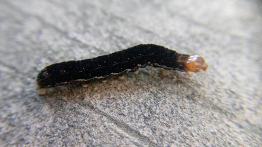

## Monday, July 13

Ed sent me his notes and photos from the Hakala plots. He and Sarah did survey plot HAK9 on Saturday.

I started on a *Refuge Notebook* article on *Sunira verberata* for this week.

I learned that *Sunira verberata* was documented defoliating *Viburnum edule* and consuming cultivated crops in 1976 in Alaska [@interagency_arctic_research_coordinating_committee_department_1977], but the specific locality was not given. The authors reported that disease and parasitism killed some of the larvae.

### 10:00 Biology meeting

* Finish last two Hakala plots.

* LTEMP/alpine CBI plots.

While searching through emails I found a thread entitled "Caterpillars run amok, take Mat Valley by storm!" in the IPM-L list. Initial post:

> I've  several calls on these guys lately, anyone know what this one is?  They seem to be munching on a wide variety of plants (inc rhubarb), covering the sides of homes and keeping at least one puppy fed.

\
Presumed *Sunira verberata* caterpillar from the Mat-Su Valley in June 2017.

Later in the thread:

> I collected what I believe are the same thing on Friday in Anchorage. ...they were found on a variety of hosts (aspen, elderberry, alder, and devil's club) as well as houses, sidewalks and other man-made structures.

### Telecon with McCrea at 15:00

* It looks like I should store observer names in a separate table.

* I should try using R Studio and Roxygen for comments on R scripts.

* R scripts will need mdEditor metadata files.

* For this Thursday's meeting I will need to explain what I have done so far and list remaining steps.

* We can soon prepare to deposit this dataset in the regional repository.
