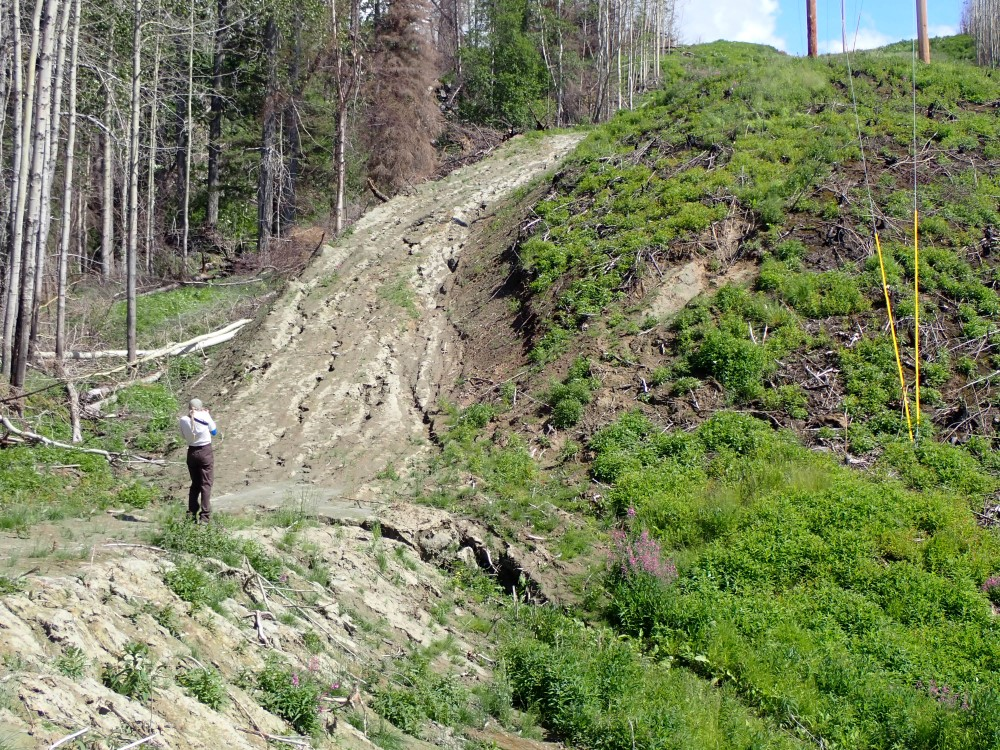

## Tuesday, July 21

<!-- 06:30- -->

I put together some of my notes from yesterday.

I pulled FMH datasheets and scanned them for Lisa and Hunter.

I edited this week's *Refuge Notebook* article.

I spent the day with Lynnda Kahn examining recent work done by HEA on the power line right of way between Three Johns Road and Jean Lake. Some poles had recently been removed cleanly with minimal damage. In contrast, the access road that HEA put in around Jean Lake and Jean Creek was poorly seeded, eroding, and weedy in places.

\
Eroded access road between Jean Lake and the east end of Skilak Lake Road.
