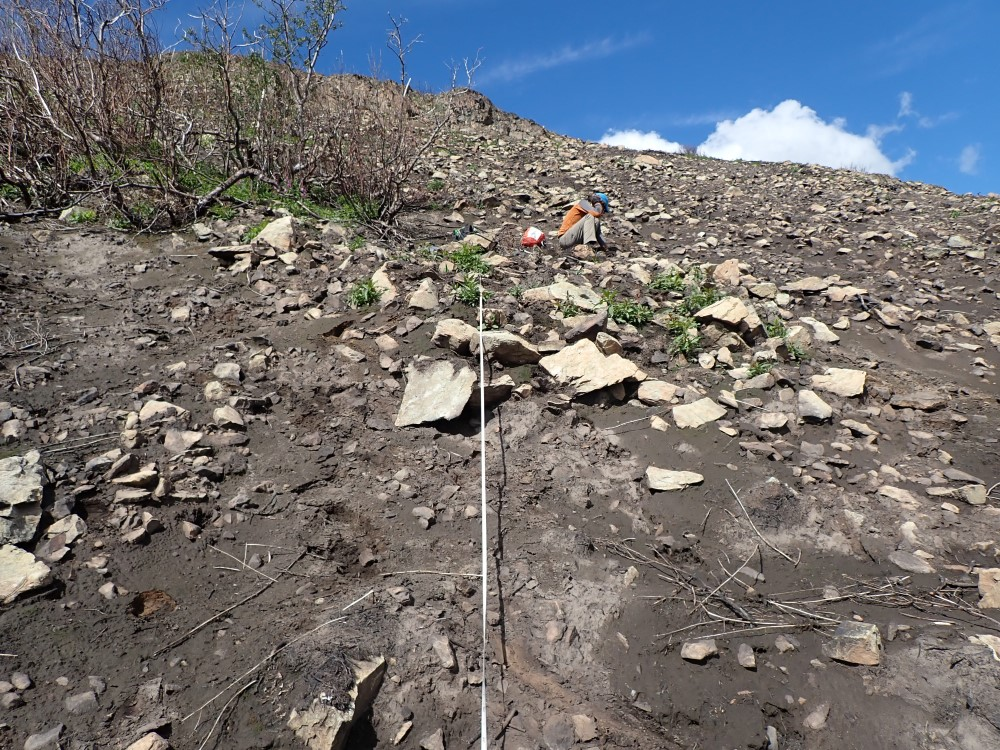

## Thursday, July 23

Ethan and I hiked up the Skyline Trail to do BAER invasive plant surveys and to look at burn severity in the alpine and subalpine.

We documented non-native plant occurrences along the trail using Survey123, occasionally just snapping photos. Along the trail we saw the non-native species 
*Matricaria discoidea* (iNaturalist: [54180986](https://www.inaturalist.org/observations/54180986)), 
*Phleum pratense* (iNaturalist: [54181213](https://www.inaturalist.org/observations/54181213)), 
*Trifolium repens* (iNaturalist: [54181736](https://www.inaturalist.org/observations/54181736)),
*Capsella bursa-pastoris* (iNaturalist: [54181941](https://www.inaturalist.org/observations/54181941)),
*Cerastium fontanum* ssp. *vulgare* (inaturalist: [54182218](https://www.inaturalist.org/observations/54182218)), and *Plantago major*, and *Poa annua*. These were all restricted to the immediate vicinity of the trail.

The hemlock stand at the saddle at the top of the Skyline Trail had burned, leaving few trees that will survive. Most of the trees in the stand had yellowing needles that were dropping. The trees themselves had been left standing, but the soil had burned beneath them. Now it was soft ash under fresh, yellow needles.

We looked for the sites from Paez's work in 1988–1989 [@paez_alpine_1991] that were just above this hemlock stand to the west and up the hill.

We first looked for Paez's site 80. We navigated to the coordinates, but failed to find any rebar or tags. We did search around the area.  We also navigated to and failed to find Paez's sites 64 and 79, but we failed to find these, also.

This area of what was probably low shrubs and tundra was severely burned. Now only rock, soil, ash, and some coarse woody debris remained, with very few surviving plants.

At the center point of the coordinates we had or Paez's site 79 we did the CBI survey via Survey123. This was at 60.53048, -150.17537, 2 m accuracy. We also inventoried all vascular plants within a 5.64 m radius (only *Chamerion angustifolium*, *Achillea borealis*, and *Ceratodon purpureus*) and collected two soil samples from the first 10 cm of soil for soil fungal DNA work.

\
5.64 m radius circular plot at Paez site 79 vicinity.

At the Skyline Trail's underpass under the Sterling Highway we saw a mustard with dissected leaves that was unfamiliar to me (iNaturalist: [54176380](https://www.inaturalist.org/observations/54176380)). I collected it.