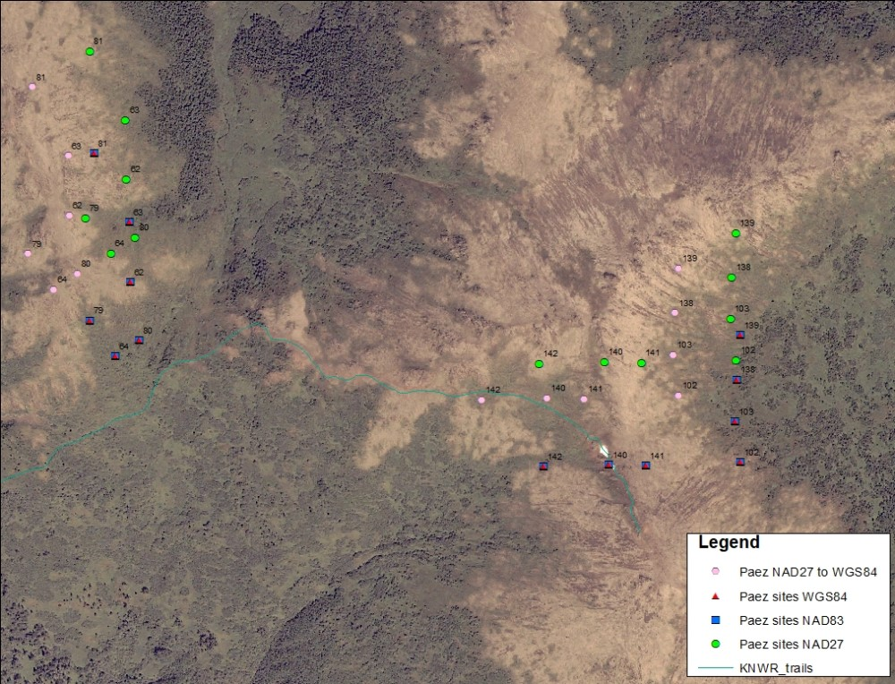

## Friday, July 24

to do

* FIA/LTEMP research plan/proposal
* *Refuge Notebook* article comments
* Inquire about remaining NGS samples/contract
* Make Avenza map for Swan Lake Fire BAER invasive plant survey work
* Review non-native species list
* ~~Check projections, etc. for Paez site data.~~
* Send Ed Hakala plot data.

I examined the mustard from yesterday (iNaturalist: [54176380](https://www.inaturalist.org/observations/54176380)). It apears to be a *Descurainia*, but I was not able to identify it because the fruits are too immature. I pressed the specimen.

I looked at the coordintaes from Paez's [-@paez_alpine_1991] vegetation plots, assuming multiple datums. The NAD27 coordinates are > 200 m away from the NAD83/WGS84 coordinates, a big difference in the alpine.

I had some trouble with ArcMap and converting between datums. I ended up with three possibilities for where each point would be. Trying this in R.

```r
wd <- "D:/projects/Fire/2019_Swan_Lake_Fire/work_space/2020-07-24_Paez_coordinates"
setwd(wd)

require(maptools)
require(rgdal)

wgs84 <- "+proj=longlat +ellps=WGS84 +datum=WGS84 +no_defs"
nad27UTMz5N <- "+proj=utm +zone=5 +datum=NAD27 +units=m +no_defs" # From https://epsg.io/26705

paeznad27 <- read.csv("2020-01-17-1447_Paez_Mystery_Hills_locaclities.csv")
coordinates(paeznad27) <- c("utm_e", "utm_n")

proj4string(paeznad27) <- CRS(nad27UTMz5N)
paezwgs84 <- spTransform(paeznad27, CRS(wgs84))

write.csv(paezwgs84, "2020-07-24-1208_Paez_from_NAD27_UTM_to_lat_lon.csv", row.names=FALSE)

```

\
Mystery Hills vegetation plot coordinates from Paez's vegetation plots, assuming multiple datums.

Both the R script above and ArcMap placed the coordinates to the north and west fo where I went, agreeing withthe pink hexagons in the map above. This set of reprojected coordinates also seems to be most consistent with alpine tundra habitat. I loaded this map (Avenza pdf) to my iPad and coordinates into my GPS.

I noticed that Paez's Mystery Hill sites were resampled in 1998 [@paez_dynamics_2009]. I wonder if these data can be dug up from ADF&G's files. I found no current contact information for Carlos Paez.

After examining more examples over the last few days, I am pretty sure that we were seeing small *Chamerion latifolium* plants on Hakala plot HAK5 on [July 20](#monday-july-20).
