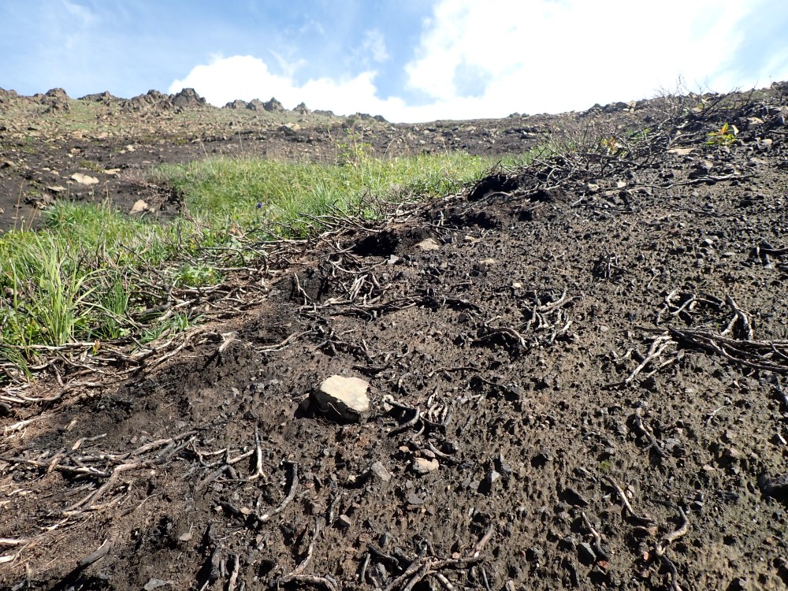
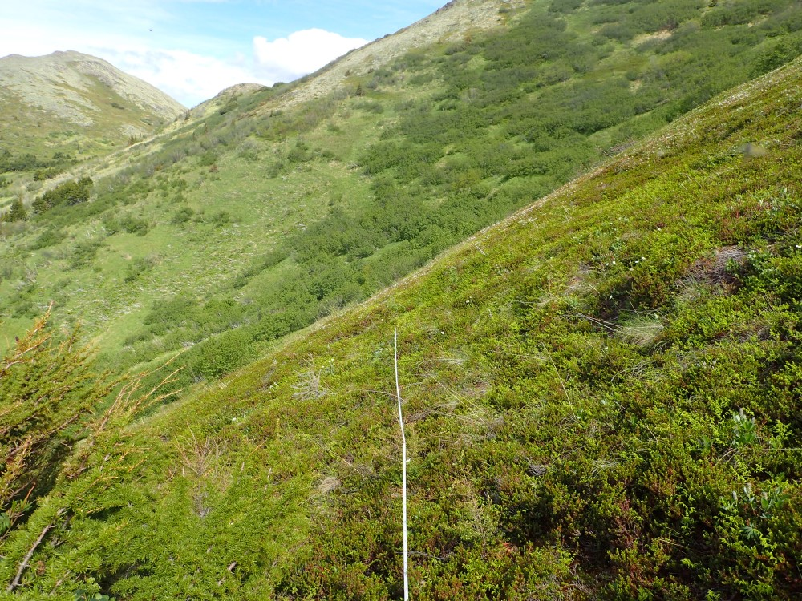
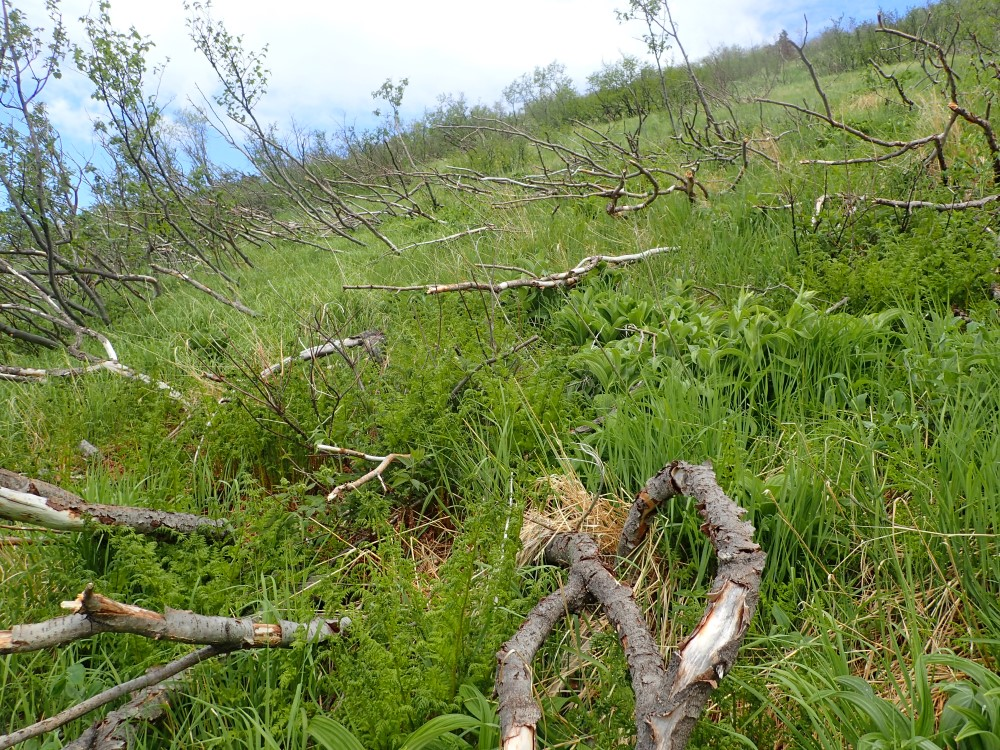

## Monday, July 27

<!-- 07:30-17:45 -->

I saw an abandoned or feral cat at the headquarters building this morning (iNaturalist: [54647478](https://www.inaturalist.org/observations/54647478)).

Annaleese and I hiked Skyline, this time with a goal looking at how the fire burned in tundra and completing CBI plots at sites where we had historical vegetation data.

We first hiked to the corrected coordinates (assuming NAD27 datum) for Paez's vegetation plots 142 and 140, but we were unable to locate the plots. From here we walked over the ridge looking into the next valley. Much of the tundra had burned here on the northeast side of the Mystery Hills.

\
Edge of unburned patch of tundra showing thickness of burned duff.

We next walked down the southwest-facing slope to site Skyline354-5 that I had put in in 2018 [@bowser_lab_notebook_2018; @bowser_field_2019]. Most of this plot had burned severely so that it was now mostly ash, soil, and rock, but there were unburned patches. A couple of hemlock seedlings had already gotten started. Here we did a CBI plot, collected soil samples for detecting soil fungi, recorded presence of plant species within a 5.64 m radius circular plot, and repeated the two (N and S) point intercept transects as was done in 2018. These were at every 0.5 m from 0.5 m to 10 m on the right side of the tape starting at plot center.

\
Plot 354-5, viewed from the south.

\
Plot Skyline354-5, viewed from the south on June 20, 2018.

It was remarkable how severly the tundra and low shrubs had burned. There were unburned areas, but where the fire had come through it was generally burned to mineral soil, greatly transforming the landscape.

We stopped by plot Skyline354-2 on the way back. This had burned, also.

\
Plot 354-2, viewed from the south. The burned fiberglass rod marking plot center is visible in the foreground.

\
Plot 354-2, viewed from the south on June 11, 2018.

On the way down we observed one occurrence of a non-native plant that I had missed on Thursday, *Alopecurus pratensis* (iNaturalist: [54664464](https://www.inaturalist.org/observations/54664464)).

