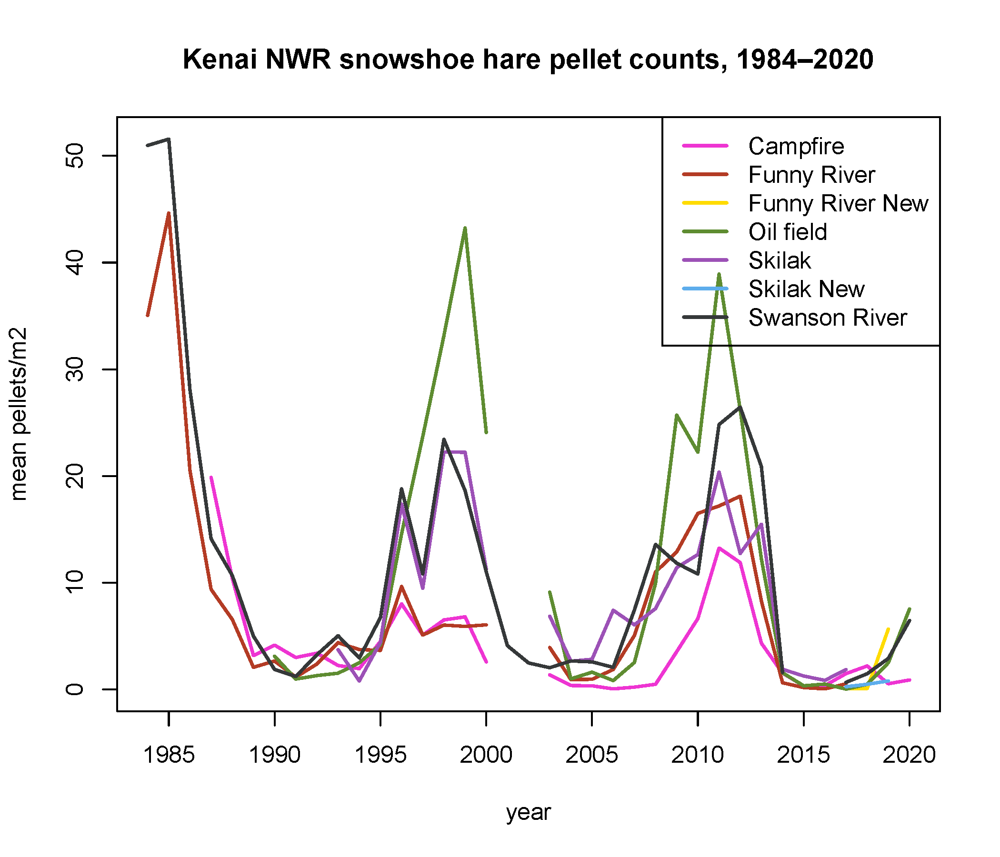

## Wednesday, July 29

to do

* ~~Respond to Lisa~~
* ~~Addition of *Adelges piceae* to the checklist of non-native species~~
* Prepare to send out morel specimens?
* Inquire about NGS contract extension.
* snowshoe hare processing / metadata

I edited the list of non-native animal species of Alaska and got these edits sent out.

I looked over next's weeks' *Refuge Notebook* article draft and provided edits and comments.

I looked into sequencing morel specimens. The North American Mycoflora project is currently transitioning to using BOLD for its sequencing service and the sequencing service is temporarily unavailable.

I worked on reorganizing the snowshoe hare pellet count dataset.

```r
## I need to reorganize data some in order to associate observers and observations, keeping these in separate tables.

## Load data.

pellet_data <- read.csv("../data/final_data/observations/snowshoe_hare_pellet_counts.csv",
 stringsAsFactors=FALSE
 )
 
									   
plot_data <- read.csv("../data/final_data/geodata/2020-03-18_snowshoe_hare_plot_data.csv",
 stringsAsFactors=FALSE
 )
 
## Join the data to get the grid_name values.
pellet_data_joined <- merge(
 plot_data[,c("plot_name", "grid_name")],
 pellet_data
 )

## Using eventID sensu http://rs.tdwg.org/dwc/terms/eventID

event <- unique(pellet_data_joined[,c("grid_name", "date")])
event <- event[order(event$date, event$grid_name),]
event$eventID <- 1:nrow(event)
  
## Now joining these back to the original data.
pellet_data_new <- merge(pellet_data_joined, event[,c("grid_name", "date", "eventID")])
## That looked good.

## Now making the observer table.
## Using recordedBy sensu http://rs.tdwg.org/dwc/terms/recordedBy
## This will be easier to enter manually...

## Saving the observation table.
pellet_data_new <- pellet_data_new[order(pellet_data_new$date, pellet_data_new$plot_name),]
write.csv(pellet_data_new[,c("plot_name", "date", "eventID", "pellet_count")],
  "../data/final_data/observations/snowshoe_hare_pellet_counts.csv",
  row.names=FALSE
  )
```

I also updated the script for generating graphic summaries. 

\
Snowshoe hare pellet counts over time.
