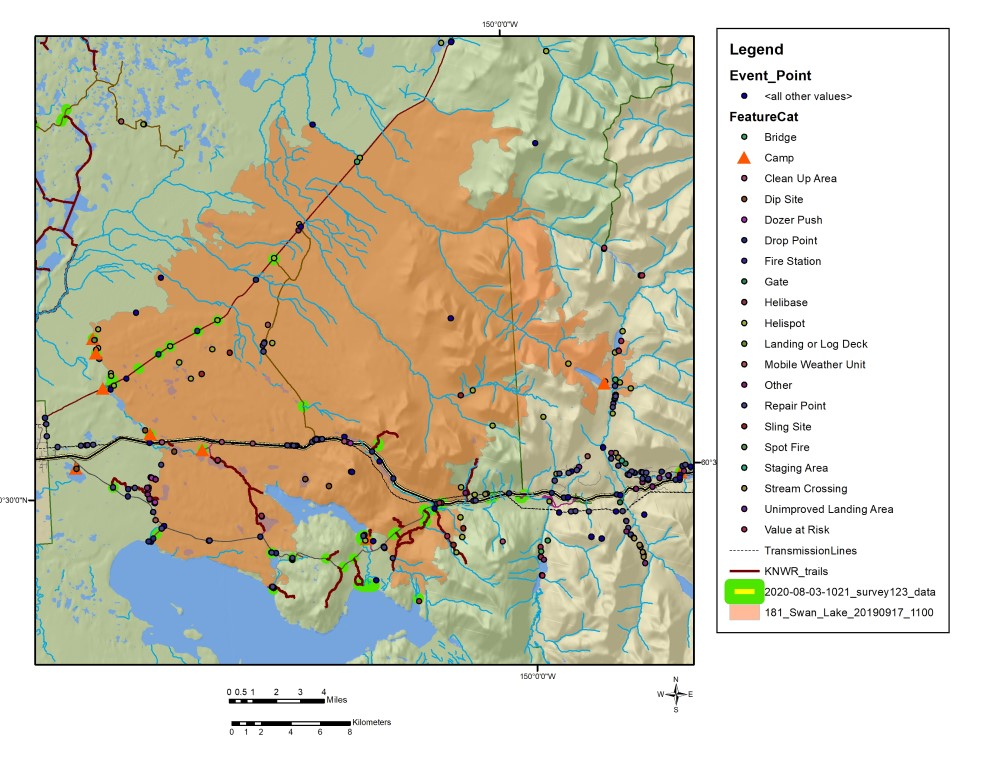

# August

## Monday, August 3

To do

* Edit this week's *Refuge Notebook*.
* ~~weed survey mapping/planning.~~

### Biology staff meeting at 08:00

* I will be working on weed survey and Skyline field work this week.
* The Sandpiper Lake elodea eradication project may go forward.

I receieved an ITS sequences from mushroom specimens I had submitted.

Specimen iNaturliast: [34708025](https://www.inaturalist.org/observations/34708025)) I had thought was a *Cortinarius*, but the sequence is identified as *Galerina badipes* using UNITE and blastn searches. My photos do not look like *Galerina badipes*. I wonder if this is a case of contamination.

Specimen iNaturliast: [34709612](https://www.inaturalist.org/observations/34709612)) is *Hygrophorus* sp. SH2252126.08FU (<https://unite.ut.ee/sh/SH2252126.08FU>) based on its ITS sequence.

Specimen iNaturliast: [34710090](https://www.inaturalist.org/observations/34710090)) appears to be *Cystodermella granulosa*. It is 99.55% similar to a sequence in species hypothesis [SH2460475.08FU](https://unite.ut.ee/sh/SH2460475.08FU) (GenBank accession [GU234151.1](https://www.ncbi.nlm.nih.gov/nucleotide/GU234151.1)).

I mapped our current invasive species records in the Swan Lake Fire from the Survey123 form.

\
Map of current non-native species data in the Swan Lake Fire area from our Survey123 form.

Mike sent me a link to a useful pdf map at <https://ftp.nifc.gov/public/incident_specific_data/alaska/2019/2019_SwanLake/Maps/20190930/Ops_arch_e_land_20190930_SwanLake_AKKKS903181.pdf>. 

Looking at the maps, it looks like we should visit sites near Fuller Lakes Trail and off of Mystery Creek Road.
