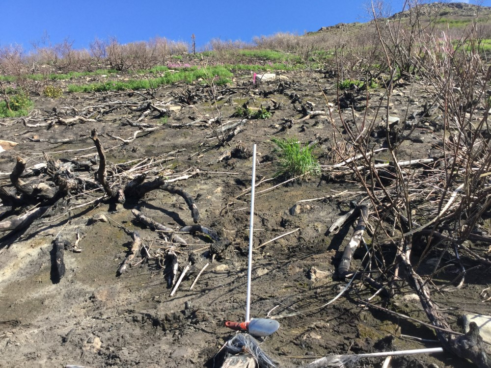

## Wednesday, August 5

I spent the day on Skyline, surveying two more of the shrub plots I had put in in 2018 with Mark. The rest of Mark's family accompanied us as far as the saddle. From there they hiked northwest up the small peak to the northwest looking for the Carlos Paez Caribou range study sites using the updated coordinates. They failed to find any of these sites.

Mark and I surveyed shrub plot 354-2, which had burned severely. We also surveyed plot 354-1, which had burned, but much less severely. Much of the plot had burned to mineral soil, but in other places only the top of the litter/duff had burned lightly so that vegetation was essentially unchanged. At these two sites we completed the CBI protocols, two 10 m, 20 point vegetation transects, and 5.64 m radius, circular plot vegetation inventories.

\
Plot Skyline354-2, looking north over plot center.

\
Plot Skyline354-1, looking north over plot center.

Tonight I sent in this week's *Refuge Notebook* article, almost forgetting to do so.