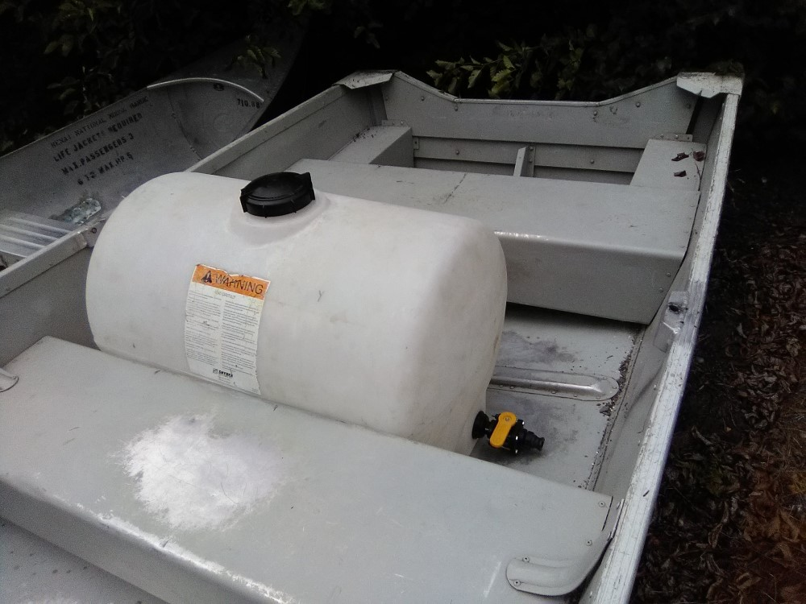

## Friday, August 7

I did some data entry, catch-up on my notes, etc.

We received the go-ahead to pursue the Sandpiper Lake elodea eradication project.

I manned the radio for a while.

I met Ben today, our new invasives EDRR lead.

I spent most of the afternoon going over equipment, getting dimensions, putting things together, and trying out the equipment in an Alumacraft T14V like we will have at Vogel Lake.

The boat's front hollow is 72 cm long by 114 cm wide at its narrowest end toward the bow.

The spreader base is 68 cm long by 60 cm wide. overall dimensions are 101 cm tall by 90 cm long by 60 cm wide, but I think the backpack blower could be removed, making the length about 70 cm. I tried it out and it fits well in the boat. It is ready to go.

\
Spreader in the boat.

The 55 gallon liquid tank is 60 cm wide and 92 cm long without valves attached. It fits, but it would need to be raised on something to keep the valve fitting from having weight on it.

\
Liquid application tank in the Alumacraft.

I tried assembling the apparatuses for pelleted and liquid applications. The pellet spreader is ready to go. We appear to be missing one of the nozzles from the liquid application setup. I wrote our staff and some others asking about this.
