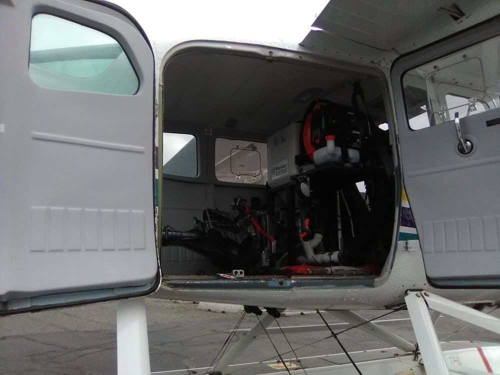

## Wednesday, August 12

Jake, Mark, and I met Nate and Jim at Soldotna Airport at 09:00. We loaded both 206's with herbicide. Nate and Jim flew this out to Sandpiper Lake, where they worked on caching it on the south shore of Sandpiper Lake.

\
Loading herbicide.

While they were away, Jake and I filled the gas tank of the outboard, connected it, and tested the outboard.

We met Nate and Jim for a second load. We inspected their aircraft for *Elodea*. We only found one fragment of *Potamogeton*. this time taking out almost all of the application equipment, including the outboard. This was also cached at Sandpiper Lake.  After dropping this off, Jim and Nate returned to Anchorage.

We spent the rest of the day getting equipment together. I printed off all of the permits, the prescription, signs, etc.

\
Pellet spreader and outboard in the 206.
