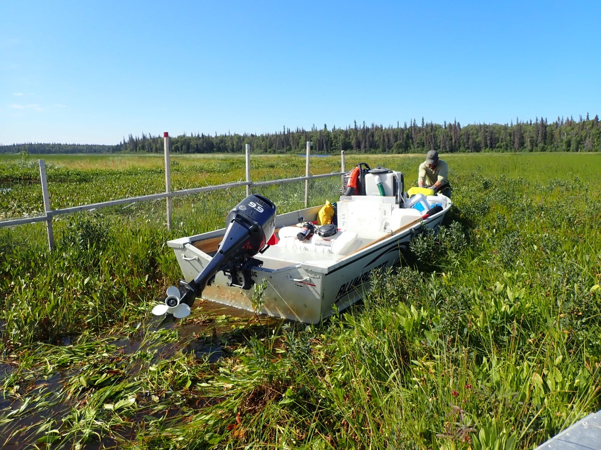

## Friday, August 14

\
Vogel Lake cabin and our tents. We did not all stay in the cabin due to COVID-19 concerns.

Colin, Jake, and I took the canoes back to Sandpiper Lake in the morning. Colin and I completed the application at Sandpiper Lake: 5 gallons of Littora at 2 gallons/acre and 840 lbs. of SonarONE.

The bigger task for the day was getting all of our remaining equipment back to Vogel Lake cabin for pick-up. We loaded all of the equipment and the unused Littora into the Alumacraft and canoes, which we had to drag much of the way through the little streams and around the pike barriers. We cleaned and inspected our boat and equipment to make sure that we brought neither *Elodea* nor residual herbicide through the other lakes.

\
Dragging the boat around a fish barrier.

I was surprised to see one individual of *Scorzoneroides autumnalis* in front of the Vogel Lake public use cabin (iNaturalist: [56765869](https://www.inaturalist.org/observations/56765869)). I pulled it.

Later Shay took us and all of our equipment to Headquarters Lake in three loads in the 185.
