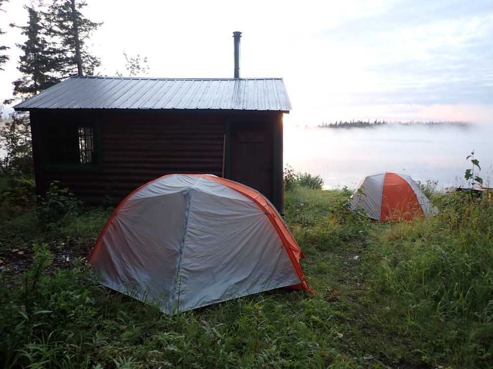
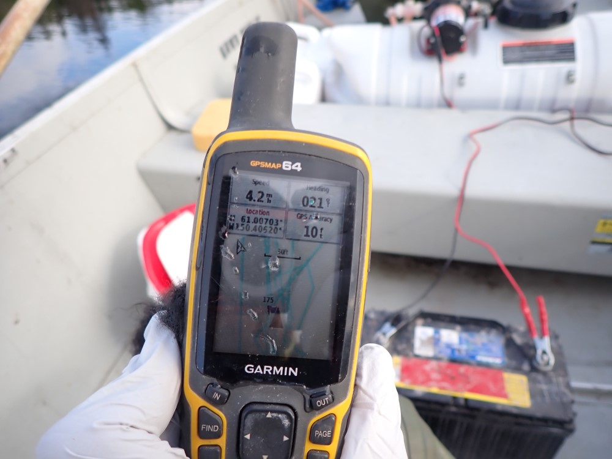

## Friday, August 14

\
Vogel Lake cabin and our tents. We did not all stay in the cabin due to COVID-19 concerns.

Colin, Jake, and I took the canoes back to Sandpiper Lake in the morning. Colin and I applied the Littora diquat over the areas where elodea was present, treating 2.5 acres in all with 5 gallons of Littora.

\
Using a GPS to apply diquat at the prescribed rate.

The bigger task for the day was getting all of our remaining equipment back to Vogel Lake cabin for pick-up. We loaded all of the equipment and the unused Littora into the Alumacraft and canoes, which we had to drag much of the way through the little streams and around the pike barriers.

