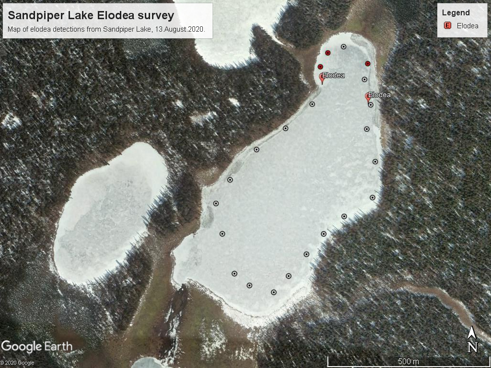

## Monday, August 17

To do:

* ~~Record notes from Sandpiper Lake treatment~~
* Finish putting away equipment
* Review spruce genetics document
* Non-native plant photos to Lynnda

I made a quick map of the distribution of *Elodea* at Sandpiper Lake based on a rake throw survey.

\
Map of *Elodea* detections at Sandpiper Lake.

