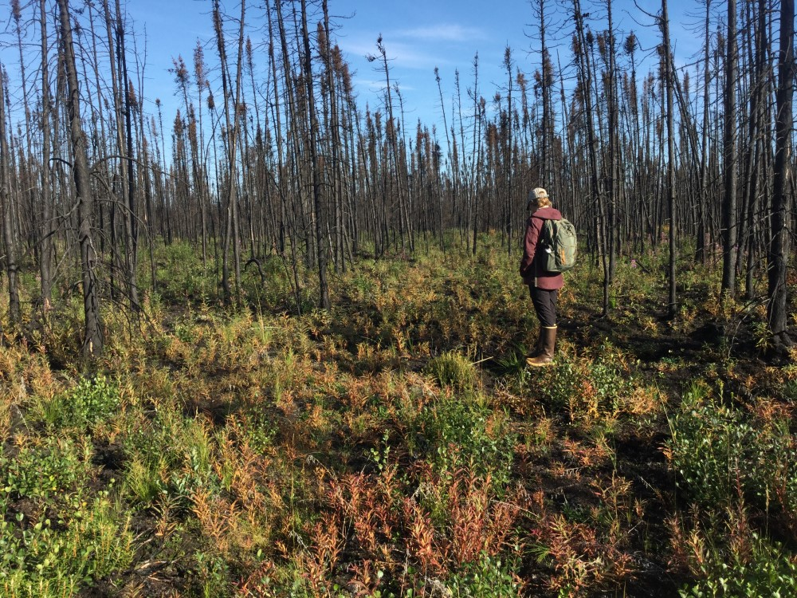

## Thursday, August 20

Annaleese and I drove out to Mystery Creek Road to survey for non-native plants in the Swan Lake Fire. We first followed an old dozer line to 60.58368, -150.31352. This line had apparently not been used by recent fire operations and was free of non-native plants.

We walked down the other direction down the line to 60.58134,-150.31758 and again we saw no non-native plants. We saw only *Phleum pratense* and *Plantago major* on the road. We used Survey123 to document non-native plant occurrences.

\
An old dozer line at 60.58135, -150.31763 that was quite weed-free.

We stopped at a small gravel pit parking lot that was quite weedy. A fuel break west of this was weed-free. We walked as far as 60.58923,-150.31615.

\
A weedy gravel pit at 60.58744, -150.31427.

We walked east to a helispot at 60.58739,-150.30463. It was quite clean in that we saw no non-native plants.

We next drove and walked to the RAWS station at 60.59851,-150.30811. We saw no weeds here.

Back at the road we checked puddles for *Psilocarphus*, but we found none. We did some surveying for weeds here.
