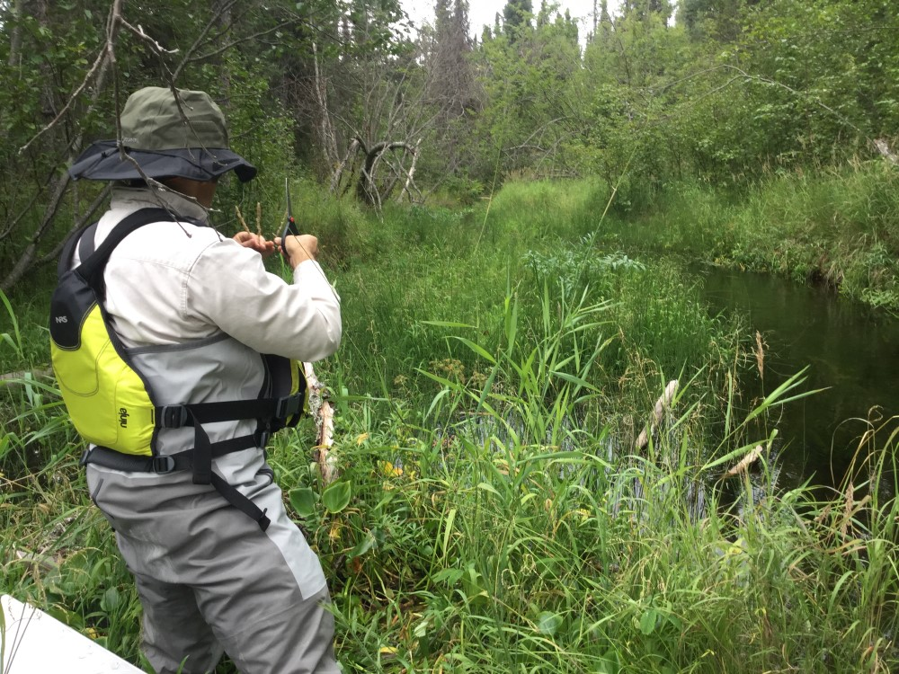

## Monday, August 24

I took care of correspondence regarding *Elodea* surveys and invoicing/billing for recent sequencing work.

I examined a plant collected at the gravel pit on Mystery Creek Road on [Thursday](#thursday-august-20) (iNaturalist: [57466121](https://www.inaturalist.org/observations/57466121)). It appears to be *Veronica peregrina*, a species that I was unfamiliar with.

Ben and I took a canoe out to Canoe Lake to look at the reed canary grass infestation out there. We found much of it along the stream between Canoe Lake #1 and Canoe Lake #2, with the biggest patch on Canoe Lake #2 at the portage to Canoe Lake #3. We cut inflorescences from most of what we saw, but we had to stop so that we would not be out too late.

\
Cutting inflorescences of *Phalaris arundinacea* along the stream between Canoe Lake #1 and Canoe Lake #2.

