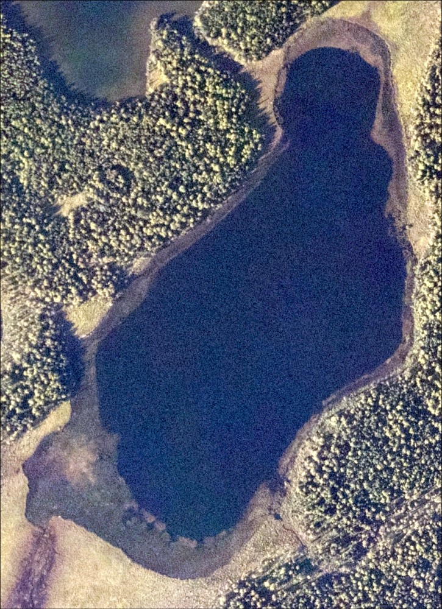

## Tuesday, August 25

* ~~Pesticide use reporting.~~
* Prepare for Sandpiper Lake tomorrow.
* Prepare for work with HEA on Thursday.
* Deal with plant specimens.
* Data back-up.

I looked at the best imagery we have of Sandpiper Lake, aerial imagery captured in 2016. The patches of *Elodea* could not be seen in this imagery. I did this in response to a request in the last statewide *Elodea* meeting to find out if *Elodea* could be seen in aerial imagery.

\
Image of Sandpiper Lake captured in 2016.

