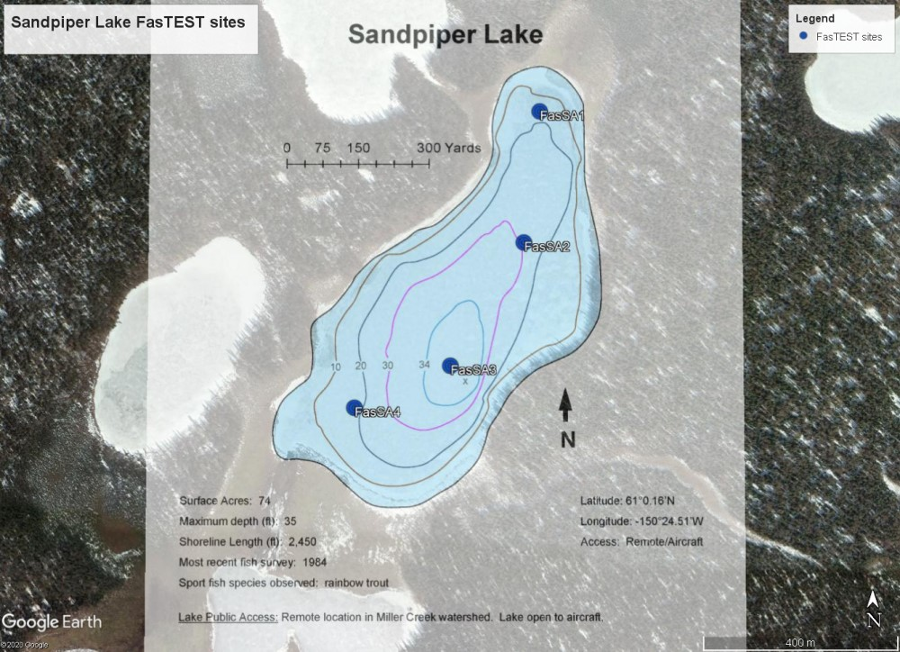

## Wednesday, August 26

To do:

* ~~Prepare for Sandpiper Lake Friday.~~
* ~~Prepare for work with HEA on Thursday.~~
* ~~Inquire about sending Dominique's material to UAM.~~
* *Refuge Notebook* catch-up.

I selected sites for fluridone concentration monitoring, spreading the fours sites along the lake and over a range of depths. I pre-labeled vials, printed a map, and loaded coordinates onto a GPS for Mark and Jake to go out on Friday.

\
FasTEST sites for fluridone concentration monitoring in Sandpiper Lake.

### Sandpiper Lake FasTEST sites

site_name|latitude|longitude
|:---|:---|:---|
FasSA1|61.00720005|-150.404666
FasSA2|61.00473547|-150.405292
FasSA3|61.00243803|-150.4081228
FasSA4|61.00165954|-150.411796

I walked over to the shop and reserved ATVs for tomorrow. Later I learned that we will not be going out tomorrow.

I saw in a report on a 1984 survey of Canoe Lake [@friedersdorff_remote_1986] that *Sagittaria cuneata* was not observed. It was abundant and present over much of the lake among the *Nuphar* when I visited on [Monday](#monday-august-24), so I believe that it has been introduced relatively recently. I do not think that it would have been missed in 1984 it looked then like it does in 2020.

