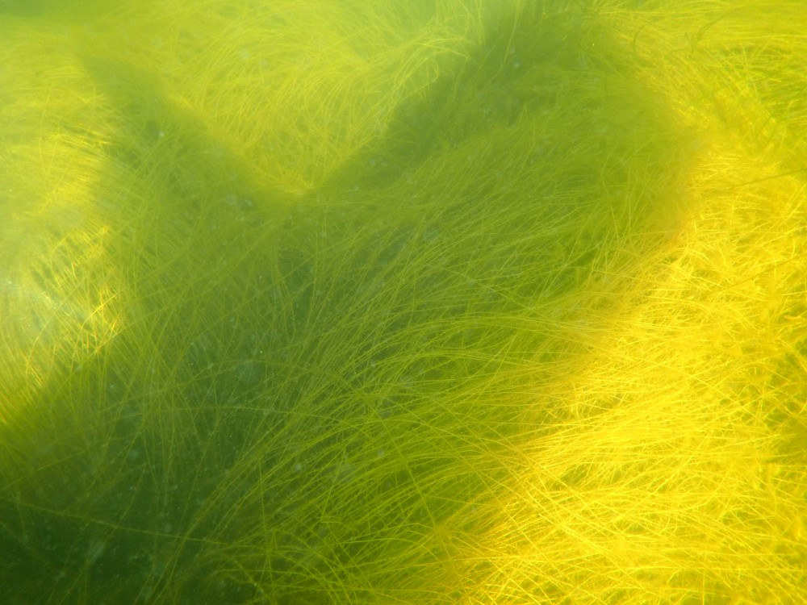
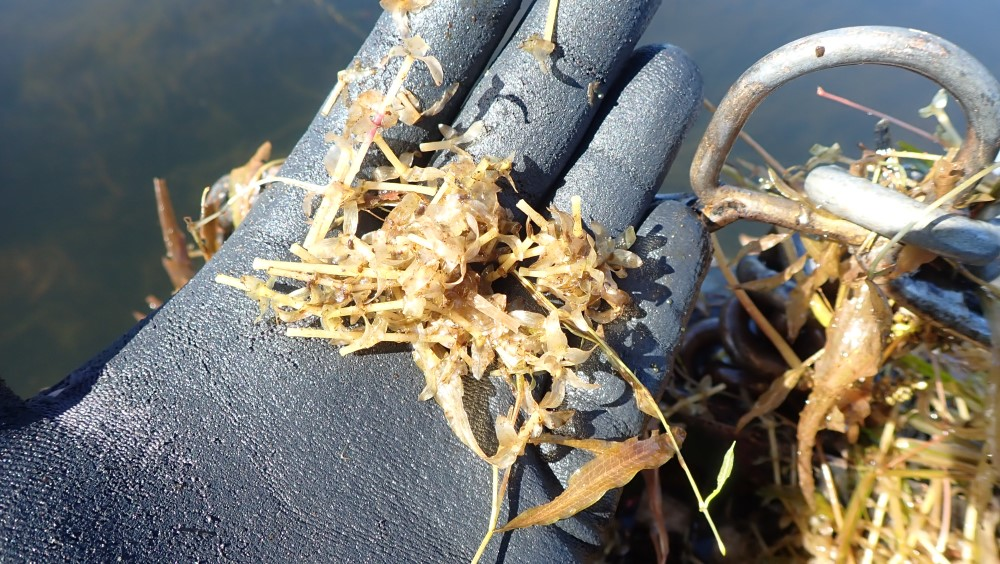
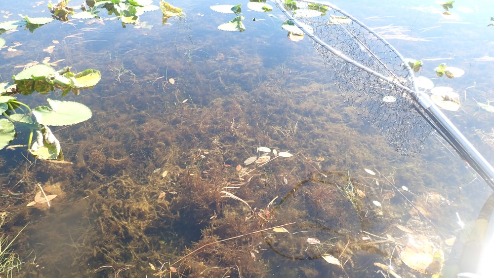

## Monday, August 31

To do:

* ~~Finish *Refuge Notebook* article.~~
* Prepare fungi specimens for DNA sequencing submission.

I finished the *Refuge Notebook* article on Kenai birch.

I got together the data, notes, etc. from the whole genome sequencing data from birches that we had done last fall and uploaded the dataset to Zenodo [@bowser_2020_4009469].

Jake stopped by and returned the camera from his trip with Mark out to Sandpiper Lake on Friday, August 28. The *Elodea* that had been treated with diquat was now yellowing and brittle.

\
Dense bed of *Elodea* in Sandpiper Lake on August 28 after treatment with diquat.

\
Brittle, yellowed *Elodea* from Sandpiper Lake on August 28.

\
Other aquatic plant species appeared to be affected less by the diquat than *Elodea* was.

At home I downloaded the *Betula pendula* genome in FASTA format from <https://ftp.ncbi.nlm.nih.gov/genomes/all/GCA/900/184/695/GCA_900184695.1_Bpev01/GCA_900184695.1_Bpev01_genomic.fna.gz>.

I tried running bowtie2 to build an index.

```sh
bowtie2-build GCA_900184695.1_Bpev01_genomic.fna GCA_900184695.1_Bpev01_genomic
```
I later ran bowtie2, but this crashed later. I also think I might not be using the correct index for *Betula pendula*.

