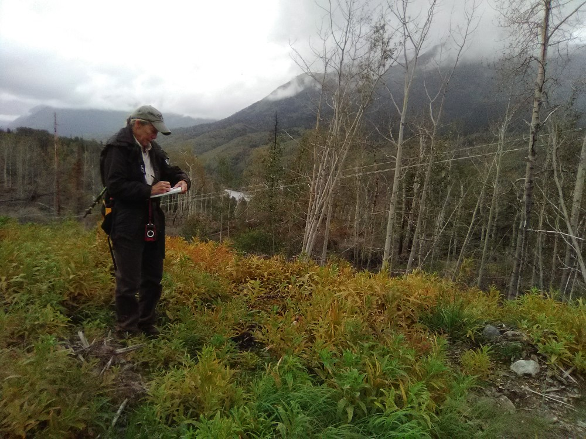

## Wednesday, September 2

I gathered LifeScanner samples and started preparing them for shipping.

I revised and submitted this week's *Refuge Notebook* article.

I accompanied Lynnda on a walk down the HEA powerline right of way north of the Sterling Highway and west of Fuller Lakes Trail. She needed to document the work that had been done here by HEA.

\
Documenting the changes to the power line access.

We revisited the unfamiliar plant that Annaleese and I had seen on [August 4](#tuesday-august-4) (iNaturalist: [55658833](https://www.inaturalist.org/observations/55658833)). Some of these now had inflorescences that were not mature. I photographed and collected these. They appear to be an *Amaranthus*. We pulled all eight or so of these plants.

I also collected a muscoid fly from the power line just above the ravine at Fuller Lakes Trail (BOLD-KO7).

