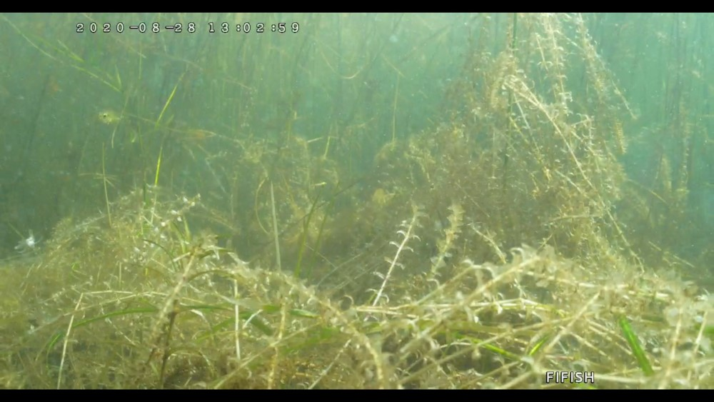
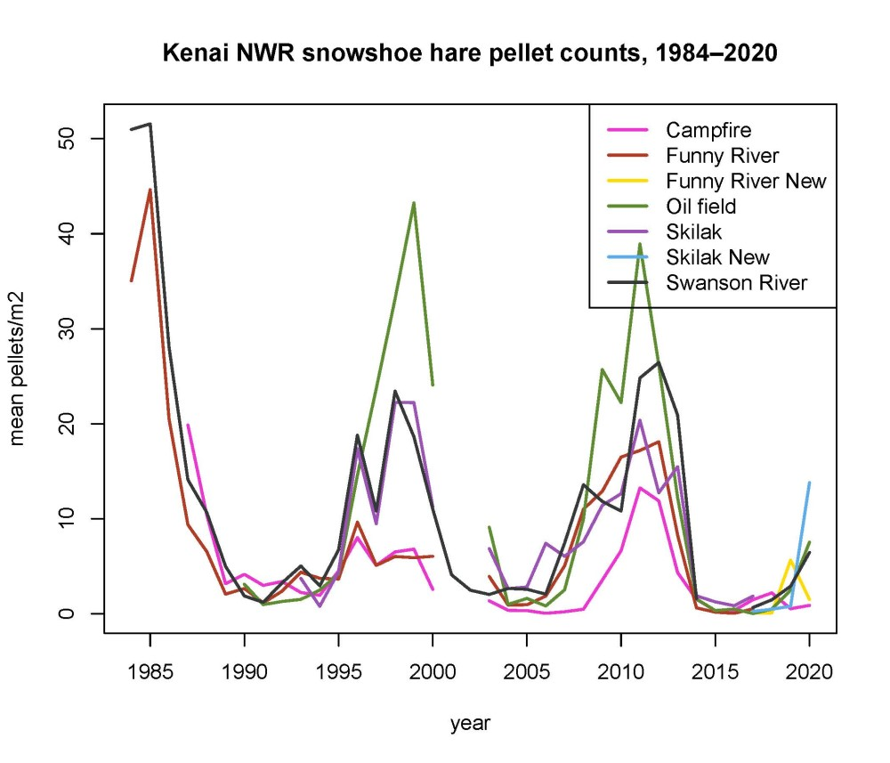

## Monday, September 8

To do:

* Spruce data/analysis to John.

Today I received fluridone concentrations results from samples collected at Sandpiper Lake on August 28.

### Fluridone concentrations from Sandpiper Lake in water samples collected on August 28, 2020.

site_name|latitude|longitude|date|fluridone_concentration_ppb
|:---|:---|:---|:---|---:|
FasSA1|61.00720005|-150.404666 |2020-08-28|8.2
FasSA2|61.00473547|-150.405292 |2020-08-28|3.7
FasSA3|61.00243803|-150.4081228|2020-08-28|3.8
FasSA4|61.00165954|-150.411796 |2020-08-28|3.5

```r
## Get the average, etc.
fl <- c(8.2, 3.7, 3.8, 3.5)
summary(fl)
   Min. 1st Qu.  Median    Mean 3rd Qu.    Max. 
   3.50    3.65    3.75    4.80    4.90    8.20 
```

I did a little working adding records to FWSpecies.

Mark had posted video footage from the ROV in Sandpiper Lake on August 28. It showed brittle, yellow, *Elodea* that broke apart when the ROV passed through it. Interestingly, the native *Potamogeton* species in the images did not appear to be as heavily damaged as the *Elodea*.

\
ROV footage from the northernmost bay of Sandpiper Lake on August 28.

I filled out the online submission form for fungal samples via the [Fungal Diversity Survey](https://fundis.org/), packaged the specimens, and drove them to FedEx Kenai (tracking #: 815820190845). 

I participated in a USFWS Vogel Lake/Miller Creek NEPA discussion call. I plan to supply species occurrence data for this.

I imported the remaining 2020 snowshoe hare pellet count data. I also worked on organizing the data and revising the metadata.

\
Snowshoe hare pellet counts, 1984–2020.
