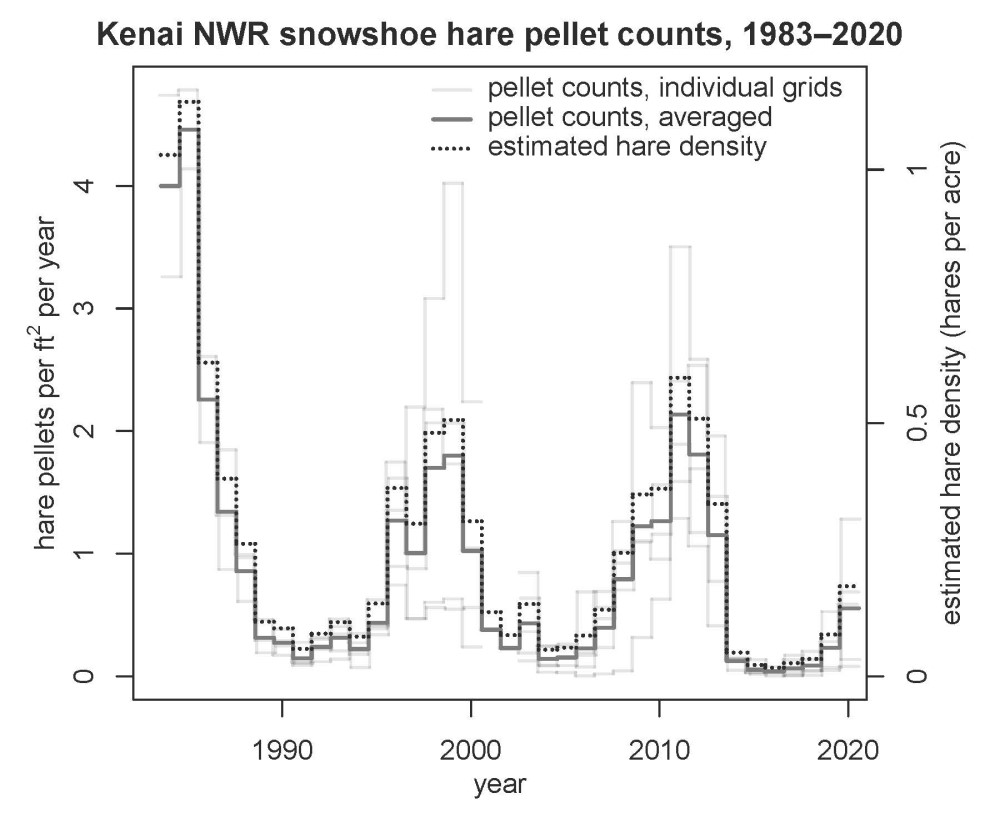

## Tuesday, September 15

I repackaged LifeScanner specimens to go out, filled out the customs form, etc. (USPS tracking #: LZ991668352US).

I continued with the hare data, also adding the linear regression of McCann et al [-@McCann_using_2008]

I found and scanned  a file summarizing snowshoe hare data and presenting density estimates from program CAPTURE [@otis_statistical_1978]. Of the models in the literature, the closest match for our data appears to be that of Krebes et al. [-@krebs_estimating_2001], which produced estimates quite close to what was estimated by program CAPTURE.

```r
################################################################################
# Summarize snowshoe hare pellet count data.                                   #
#                                                                              #
# Author: First and last name <matt_bowser@fws.gov>                            #
# Date created: 2020-04-08                                                     #
# Date last edited: 2020-09-15                                                 #
################################################################################


# Setup ------------------------------------------------------------------------

# Load packages
library(reshape2)

# Source external scripts
#source("directory_path/script_foo.R")


# 1 Load data -----------------------------------------------------------------
## ---- load_data  

pellet_data <- read.csv("../data/final_data/observations/snowshoe_hare_pellet_counts.csv",
 stringsAsFactors=FALSE
 )
 
plot_data <- read.csv("../data/final_data/geodata/snowshoe_hare_plot_data.csv",
 stringsAsFactors=FALSE
 )

# 2 Prepare data ---------------------------------------------------------------
## ---- prep_data  

## Adding a year field for now, which should work.
pellet_data$year <- as.numeric(substr(pellet_data$date, 1, 4))

## Join the data to get the grid_name values.
pellet_data_joined <- merge(
 plot_data[,c("plot_name", "grid_name")],
 pellet_data
 )
 
## Now it would be good to fill in missing dates. Because each grid was supposed to been surveyed at about the same time each year, we should be able to use the known dates to infer rough dates for when these were usually done.

## First, for each grid we should get the Julian dates when they were usually surveyed.
has_date <- nchar(pellet_data_joined$date) == 10
grids_dates <- unique(pellet_data_joined[has_date, c("grid_name", "date", "year")])
grids_dates$origin <- as.Date(paste0(grids_dates$year, "-01-01"))
grids_dates$julian <- NA
for (this_row in 1:nrow(grids_dates))
 {
 grids_dates$julian[this_row] <- julian(as.Date(grids_dates$date[this_row]), origin=grids_dates$origin[this_row]) + 1
 }
grids_mean_dates <- aggregate(grids_dates$julian, by=list(grids_dates$grid_name), mean)
names(grids_mean_dates) <- c("grid_name", "julian")
grids_mean_dates$julian <- round(grids_mean_dates$julian)

## Now we should fill in missing dates with the average dates.
pellet_data_joined <- merge(pellet_data_joined, grids_mean_dates, by="grid_name", all.x=TRUE)
pellet_data_joined$date_est <- as.Date(paste0(pellet_data_joined$year, pellet_data_joined$julian), format="%Y%j")
no_date <- nchar(pellet_data_joined$date) == 4
pellet_data_joined$date[no_date] <- as.character(pellet_data_joined$date_est[no_date])
pellet_data_joined <- pellet_data_joined[,1:7] 

## Convert the plot names to plot numbers.
plot_number <- strsplit(pellet_data_joined$plot_name,
 "-"
 )
plot_number <- sapply(plot_number,
 "[",
 2
 ) 
pellet_data_joined$plot_name <- as.numeric(plot_number)
 
## Reshape the data into a grid_name X plot number X year array.
pellet_data_molten <- melt(pellet_data_joined,
 measure.vars="pellet_count"
 )

pellet_data_array <- acast(
 pellet_data_molten,
 grid_name ~ plot_name ~ year,
 fun.aggregate=sum,
 fill=9999 ## Temporary fill value.
 )
pellet_data_array[pellet_data_array==9999] <- NA
 
n_grids <- dim(pellet_data_array)[1]
n_plots <- dim(pellet_data_array)[2]
n_years <- dim(pellet_data_array)[3]

## Set to NA any plot for which the previous year's count was NA.
for (this_grid in 1:n_grids)
 {
 for (this_plot in 1:n_plots)
  {
  for (this_year in n_years:2)
   if(is.na(pellet_data_array[this_grid,this_plot,this_year-1]))
    {
	pellet_data_array[this_grid,this_plot,this_year] <- NA
	}
  }
 }
 
## Also set all year 1 observations to NA.
pellet_data_array[,,1] <- NA

## Now get averages.
pellet_count_means <- as.data.frame(apply(pellet_data_array,
 c(1,3),
 mean,
 na.rm=TRUE
 ))

## Reformatting so that start and end dates can be incorporated. 
pellet_count_means$grid_name <- row.names(pellet_count_means)
pellet_count_means_molten <- melt(pellet_count_means, id.vars="grid_name")
names(pellet_count_means_molten)[2] <- "year" 
pellet_count_means_molten$variable <- "mean_pellets_m2"

## We need start and end dates for each grid and year.
pellet_data_joined$end_date <- pellet_data_joined$date
## Getting the start dates will take a little more work.
pellet_data_dates <- unique(pellet_data_joined[c("grid_name", "year", "end_date")])
pellet_data_dates$year <- pellet_data_dates$year + 1
names(pellet_data_dates)[3] <- "start_date"
pellet_data_joined <- merge(pellet_data_joined, pellet_data_dates, by=c("grid_name", "year"), all.x=TRUE)
pellet_data_dates <- unique(pellet_data_joined[c("grid_name", "year", "start_date", "end_date")])

pellet_count_annual_data <- merge(pellet_count_means_molten,
 pellet_data_dates,
 by=c("grid_name", "year"),
 all.x=TRUE
 )
## Dropping the no data years.
#pellet_count_annual_data <- pellet_count_annual_data[!is.nan(pellet_count_annual_data$value),]

## Now calculate the time differences between start and end dates.
pellet_count_annual_data$time_dif_days <- as.numeric(as.Date(pellet_count_annual_data$end_date) - as.Date(pellet_count_annual_data$start_date))
pellet_count_annual_data$time_dif_years <- pellet_count_annual_data$time_dif_days/365.2422

## Calculate pellets per m2 per year.
pellet_count_annual_data$pellets_m2yr <- pellet_count_annual_data$value/pellet_count_annual_data$time_dif_years

## Cleaning up this data frame a bit for use later.
pellet_count_annual_data$year <-as.numeric(as.character(pellet_count_annual_data$year))
pellet_count_annual_data$start_date <- as.Date(pellet_count_annual_data$start_date)
pellet_count_annual_data$end_date <- as.Date(pellet_count_annual_data$end_date)
names(pellet_count_annual_data)[3] <- "pellets_m2"
pellet_count_annual_data <- pellet_count_annual_data[,c(1:3,5:9)]

## It might be useful to calculate a grand mean for clarity on the graph.
data_agg <- aggregate(pellet_count_annual_data$pellets_m2yr,
 by=list(pellet_count_annual_data$year),
 mean,
 na.rm=TRUE
 )
names(data_agg) <-c("year", "pellets_m2yr")
data_agg$start_date <- aggregate(pellet_count_annual_data$start_date,
 by=list(pellet_count_annual_data$year),
 mean,
 na.rm=TRUE
 )$x
data_agg$end_date <- aggregate(pellet_count_annual_data$end_date,
 by=list(pellet_count_annual_data$year),
 mean,
 na.rm=TRUE
 )$x 
data_agg <- data_agg[2:nrow(data_agg),]

## Now add density estimates.

## Functions from papers.
Krebs_et_al_1987 <- function(pellets_m2yr)
 {
 ## First convert pellets_m2yr to pellets per 0.155 m2 per year.
 pellets_0155 <- pellets_m2yr*0.155
 
 hares_ha <- 0.27*pellets_0155 + 0.42
 hares_ha
 }
data_agg$Krebs_et_al_1987 <- Krebs_et_al_1987(data_agg$pellets_m2yr)

Krebs_et_al_2001 <- function(pellets_m2yr)
 {
 ## First convert pellets_m2yr to pellets per 0.155 m2 per year.
 pellets_0155 <- pellets_m2yr*0.155
 
 ## Apply regression.
 hares_ha <- exp(-1.203 + 0.889*log(pellets_0155))
 
 ## Apply correction factor.
 hares_ha <- 1.567*hares_ha
 hares_ha
 }
data_agg$Krebs_et_al_2001 <- Krebs_et_al_2001(data_agg$pellets_m2yr)

Murray_et_al_2002 <- function(pellets_m2yr)
 {
 pellets_m2yr <- log(pellets_m2yr + 1/6)
 
 hares_ha <- 1.423 * (2.077 - exp(-.662*pellets_m2yr))
 hares_ha
 
 hares_ha <- exp(hares_ha) - 1/6
 hares_ha
 }
#data_agg$Murray_et_al_2002 <- Murray_et_al_2002(data_agg$pellets_m2yr)
## This estimate is an order of magnitude higher than the other estimates, so I am dropping it. I may be getting the formula wrong.

Mills_et_al_2005_Seeley <- function(pellets_m2yr)
 {
 ## First convert pellets_m2yr to pellets per 0.155 m2 per year.
 pellets_0155 <- pellets_m2yr*0.155
 
 ## Apply regression.
 hares_ha <- exp(-1.67 + 0.77*log(pellets_0155))
 
 ## Apply correction factor.
 hares_ha <- 1.567*hares_ha
 hares_ha
 }
data_agg$Mills_et_al_2005_Seeley <- Mills_et_al_2005_Seeley(data_agg$pellets_m2yr)

Mills_et_al_2005_Tally <- function(pellets_m2yr)
 {
 ## First convert pellets_m2yr to pellets per 0.155 m2 per year.
 pellets_0155 <- pellets_m2yr*0.155
 
 ## Apply regression.
 hares_ha <- exp(-1.14 + 0.63*log(pellets_0155))
 
 ## Apply correction factor.
 hares_ha <- 1.567*hares_ha
 hares_ha
 }
data_agg$Mills_et_al_2005_Tally <- Mills_et_al_2005_Tally(data_agg$pellets_m2yr)

McCann_et_al_2008 <- function(pellets_m2yr)
 {
 hares_ha <- 0.060*pellets_m2yr + 0.398
 hares_ha
 }
data_agg$McCann_et_al_2008 <- McCann_et_al_2008(data_agg$pellets_m2yr) 

Berge_and_Gese_2010 <- function(pellets_m2yr)
 {
 hares_ha <- 0.0921*pellets_m2yr + 0.0524
 hares_ha
 }
data_agg$Berge_and_Gese_2010 <- Berge_and_Gese_2010(data_agg$pellets_m2yr)
 

## Plot.

## Flag to use metric or standard units.
#units <- "metric"
units <- "standard"

plot_title <- paste0("Kenai NWR snowshoe hare pellet counts, ",
 min(pellet_count_annual_data$year),
 "–",
 max(pellet_count_annual_data$year)
 )

ylab <- expression(paste("hare pellets per m"^"2", " per year"))
dlab <- "estimated hare density (hares per hectare)"

density_ticks <- 0:10

if (units == "standard")
 {
 ylab <- expression(paste("hare pellets per ft"^"2", " per year"))
 pellet_count_annual_data$pellets_m2yr <- pellet_count_annual_data$pellets_m2yr/10.7639
 data_agg$pellets_m2yr <- data_agg$pellets_m2yr/10.7639
 dlab <- "estimated hare density (hares per acre)"
 data_agg$Krebs_et_al_2001 <- data_agg$Krebs_et_al_2001/2.47105
 density_ticks <- (0:10)/2
 }
 
file_name <- paste0("../documents/",
 as.Date(Sys.time()),
 "_pellet_count_over_time.pdf"
 )
 
lcol <- "#0000001F"
lwd=1.5
lty=rep(1, 7)

grid_name <- levels(as.factor(pellet_count_annual_data$grid_name))
this_grid <- 1

sl <- pellet_count_annual_data$grid_name == grid_name[this_grid]
sln <- pellet_count_annual_data$grid_name == grid_name[this_grid] & !is.nan(pellet_count_annual_data$pellets_m2yr)

ylim <- c(0, max(pellet_count_annual_data$pellets_m2yr, na.rm=TRUE))

pdf(file=file_name,
 width=6,
 height=5
 )
par(mar=c(4,4,2,4))
plot(pellet_count_annual_data$start_date[sl],
 pellet_count_annual_data$pellets_m2yr[sl],
 type="n",
 ylim=ylim,
 main=plot_title,
 xlab="",
 ylab=""
 )
mtext(text="year",
 side=1,
 line=2
 )
mtext(text=ylab,
 side=2,
 line=2
 )
mtext(text=dlab,
  side=4,
  line=2
  )
## Draw segments showing pellet densities. 
segments(pellet_count_annual_data$start_date[sln],
 pellet_count_annual_data$pellets_m2yr[sln],
 pellet_count_annual_data$end_date[sln],
 pellet_count_annual_data$pellets_m2yr[sln],
 col=lcol,
 lwd=lwd,
 lty=lty[this_grid]
 )
## connect non-missing segments.
for (this_row in 2:nrow(pellet_count_annual_data))
 {
 if (sln[this_row-1] & sln[this_row])
  {
  segments(pellet_count_annual_data$start_date[this_row],
   pellet_count_annual_data$pellets_m2yr[this_row-1],
   pellet_count_annual_data$start_date[this_row],
   pellet_count_annual_data$pellets_m2yr[this_row],
   col=lcol,
   lwd=lwd,
   lty=lty[this_grid]
   )
  }
 }
 
for (this_grid in 2:n_grids)
 {
 sln <- pellet_count_annual_data$grid_name == grid_name[this_grid] & !is.nan(pellet_count_annual_data$pellets_m2yr)
## Draw segments showing pellet densities. 
segments(pellet_count_annual_data$start_date[sln],
 pellet_count_annual_data$pellets_m2yr[sln],
 pellet_count_annual_data$end_date[sln],
 pellet_count_annual_data$pellets_m2yr[sln],
 col=lcol,
 lwd=lwd,
 lty=lty[this_grid]
 )
## connect non-missing segments.
for (this_row in 2:nrow(pellet_count_annual_data))
 {
 if (sln[this_row-1] & sln[this_row])
  {
  segments(pellet_count_annual_data$start_date[this_row],
   pellet_count_annual_data$pellets_m2yr[this_row-1],
   pellet_count_annual_data$start_date[this_row],
   pellet_count_annual_data$pellets_m2yr[this_row],
   col=lcol,
   lwd=lwd,
   lty=lty[this_grid]
   )
  }
 } 
 }
 ## Now plot the grand mean lines.
 segments(data_agg$start_date,
  data_agg$pellets_m2yr,
  data_agg$end_date,
  data_agg$pellets_m2yr,
  col="#777777",
  lwd=2,
  lty=1
  )
 for (this_row in 2:nrow(data_agg))
 {
  segments(data_agg$start_date[this_row],
   data_agg$pellets_m2yr[this_row-1],
   data_agg$start_date[this_row],
   data_agg$pellets_m2yr[this_row],
   col="#777777",
   lwd=2,
   lty=1
   )
 }
 ## Now plot the estimated hare densities.
 adjustment_factor <- max(pellet_count_annual_data$pellets_m2yr, na.rm=TRUE)/max(data_agg$Krebs_et_al_2001)*.98
 data_agg$Krebs_et_al_2001_adj <- data_agg$Krebs_et_al_2001 * adjustment_factor
  segments(data_agg$start_date,
  data_agg$Krebs_et_al_2001_adj,
  data_agg$end_date,
  data_agg$Krebs_et_al_2001_adj,
  col="#000000",
  lwd=2,
  lty="11"
  )
 for (this_row in 2:nrow(data_agg))
 {
  segments(data_agg$start_date[this_row],
   data_agg$Krebs_et_al_2001_adj[this_row-1],
   data_agg$start_date[this_row],
   data_agg$Krebs_et_al_2001_adj[this_row],
   col="#000000",
   lwd=2,
   lty="11"
   )
 }
 axis(side=4,
  at=density_ticks*adjustment_factor,
  labels=density_ticks
  )

text(x=as.Date("2000-01-01"),
 y=ylim[2] * c(1,0.95,0.9),
 labels= c("pellet counts, individual grids", "pellet counts, averaged", "estimated hare density"),
 pos=4
 )
segments(x0 = as.Date("1998-01-01"),
 y0 = ylim[2] * c(1,0.95),
 x1 = as.Date("2000-01-01"),
 y1 = ylim[2] * c(1,0.95),
 lwd = c(1.5, 2),
 lty = c(1,1),
 col = c("#0000001F", "#777777")
 ) 
segments(x0 = as.Date("1998-01-01"),
 y0 = ylim[2] * 0.9,
 x1 = as.Date("2000-01-01"),
 y1 = ylim[2] * 0.9,
 lwd = 2,
 lty = "11",
 col=("#000000")
 ) 
dev.off() 

## Save means summaries.
file_name <- paste0("../documents/",
 as.Date(Sys.time()),
 "_pellet_count_means_over_time.csv"
 )
write.csv(pellet_count_annual_data,
 file_name,
 row.names=FALSE
 ) 

## Save the grand mean summary, also.
 file_name <- paste0("../documents/",
 as.Date(Sys.time()),
 "_grand_means_over_time.csv"
 )
write.csv(data_agg,
 file_name,
 row.names=FALSE
 ) 
```

\
Snowshoe hare pellet counts over time and estimated snowshoe hare densities.

I took a walk down to Headquarters Lake and Nordic Lake in the afternoon. I checked both lakes for any duckweeds, looking especially for *Spirodela*. I saw no duckweeds. I collected some larvae from mushrooms and soil, which I placed in LifeScanner vials.

In looking into the ecology of hare cycles, I found Boutin et al. [-@boutin_population_1995] and Krebs et al. [-@krebs_using_2018] to be helpful. Interestingly, both Buckley [-@buckley_animal_1954] and Boutin et al. [-@boutin_population_1995] documented the same relationship of grouse peaking just before hares.
