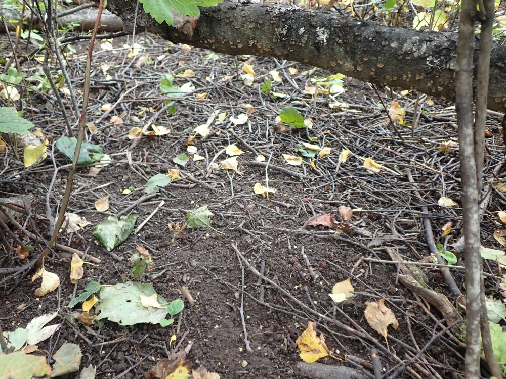
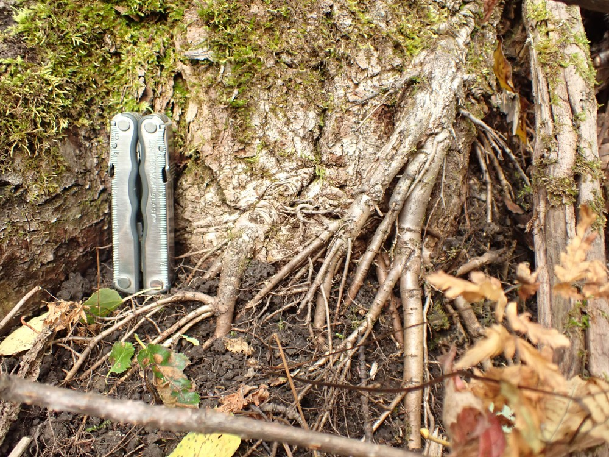
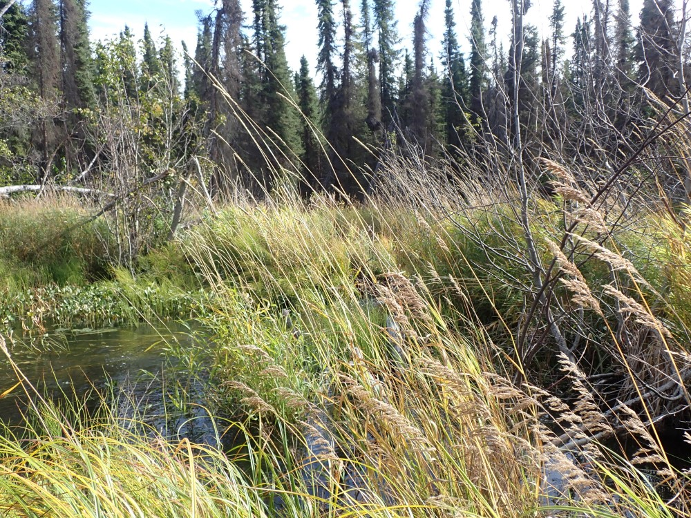

## Friday, September 18

```r

## R script to summarize and reformat data from non-native plant surveys collected using Survey123.

## By Matt Bowser, 18.September2020

library(maptools)
library(rgdal)
library(raster)

load("2020-09-17-1643_workspace.RData")

## Load Swan Lake Fire perimeter.
Swan_Lake_Fire <- readOGR(dsn="../source_data/geodata/2019_Swan_Lake_Fire/181_Swan_Lake_20190917_1100.shp",
 stringsAsFactors=FALSE 
 ) 

exported_data01 <- exported_data
exported_data01@data <- data01

Swan_Lake_Fire_wgs84 <- spTransform(Swan_Lake_Fire, CRS(proj4string(exported_data01)))

in_fire <- over(exported_data01, Swan_Lake_Fire_wgs84)

exported_data01@data$in_fire <- in_fire$NAME

## Do any of the treated areas in the fire lack a polygon?
exported_data01@data[!is.na(exported_data01@data$area_treated_acres),c("in_fire", "area_treated_acres", "Shape__Are")]
## Only four of the treated areas are in the fire and they all have non-zero shape area values.

exported_data_in_fire <- exported_data01[!is.na(exported_data01@data$in_fire),]

## Summarize for Lisa the number of acres treated in the fire:
sum(exported_data_in_fire@data$area_treated_acres, na.rm=TRUE)
[1] 2.85

## Now exporting this for Lisa.
writeOGR(obj=exported_data_in_fire, 
 dsn="../data/final_data/observations/2020-09-18-0852_treatments_in_fire.shp",
 layer="exported_data_in_fire",
 driver="ESRI Shapefile"
 )

## Now I need to get non-native plant species records to Lisa.
## There are still some missing values.
scinamemiss <- is.na(data02$scientificName)
data02[scinamemiss,]
## One has a common name only.
data02$scientificName[scinamemiss & data02$common_nam==27] <- "Taraxacum officinale F.H. Wigg."
scinamemiss <- is.na(data02$scientificName)
data02[scinamemiss,]
data02$scientificName[(scinamemiss & data02$other_na_1=="Reed canary grass")] <- "Phalaris arundinacea"
scinamemiss <- is.na(data02$scientificName)
data02[scinamemiss,]
data02$scientificName[(scinamemiss & data02$other_na_1=="Water Forget Me Not")] <- "Myosotis scorpioides"
scinamemiss <- is.na(data02$scientificName)
data02[scinamemiss,]
data02$scientificName[(scinamemiss & data02$other_na_1=="Water Forget-Me-Not")] <- "Myosotis scorpioides"
scinamemiss <- is.na(data02$scientificName)
data02[scinamemiss,]
data02$scientificName[(scinamemiss & data02$other_na_1=="Orange hawkweed")] <- "Hieracium aurantiacum"
scinamemiss <- is.na(data02$scientificName)
data02[scinamemiss,]
data02$scientificName[(scinamemiss & data02$other_na_1=="Reed canary grass and meadow forget me not present")] <- "Phalaris arundinacea"
## Duplicating these records.
addrows <- data02[(scinamemiss & data02$other_na_1=="Reed canary grass and meadow forget me not present"),]
addrows$scientificName <- "Myosotis scorpioides"
data02 <- rbind(data02, addrows)
scinamemiss <- is.na(data02$scientificName)
data02[scinamemiss,]

## Dropping those Juncus bufonius records, a native plant.
data03 <- data02[!(data02$scientificName=="Juncus bufonis"),]
## Saving this.
write.csv(data03, 
 "../data/final_data/observations/2020-09-18-1007_observations.csv",
 row.names=FALSE
 )

## Now selecting records from within the fire.
coordinates(data03) <- c("longitude", "latitude")
proj4string(data03) <- proj4string(exported_data01) 
in_fire <- over(data03, Swan_Lake_Fire_wgs84)
data03$in_fire <- in_fire$NAME

## Just checking.
plot(Swan_Lake_Fire_wgs84, col="red")
points(data03[!is.na(data03$in_fire),])
## That looked good.

weed_obs_in_fire <- data03[!is.na(data03$in_fire),]
dim(weed_obs_in_fire)
[1] 82 48
## So 82 observations in the fire.

## How many species in the fire?
length(levels(as.factor(weed_obs_in_fire$scientificName)))
[1] 20

## Save these.
write.table(levels(as.factor(weed_obs_in_fire$scientificName)), 
 "../data/final_data/observations/2020-09-18-1015_weed_species_in_fire.csv",
 row.names=FALSE,
 col.names="scientificName"
 )
 
## How many acres were infested?
sum(weed_obs_in_fire$infested_a)
## No!!! These are a mess, too. Why do these have to be text and not numeric?
weed_obs_in_fire$infested_a <- gsub(" acre", "", weed_obs_in_fire$infested_a) 
weed_obs_in_fire$infested_a <- gsub("s", "", weed_obs_in_fire$infested_a)
## Assuming 0.001 acres for those where nothing was given.
weed_obs_in_fire$infested_a[is.na(weed_obs_in_fire$infested_a)] <- "0.001"
weed_obs_in_fire$infested_a <- as.numeric(weed_obs_in_fire$infested_a)
sum(weed_obs_in_fire$infested_a)
[1] 57.983

## Finally, save the weed observations in the fire as a shapefile.
writeOGR(obj=weed_obs_in_fire, 
 dsn="../data/final_data/observations/2020-09-18-1018_non-native_plant_obs_in_fire.shp",
 layer="weed_obs_in_fire",
 driver="ESRI Shapefile"
 ) 
```

I sent these data to Lisa.

I drove out Swanson River Road looking for *Spirodela*.

At Weed Lake I saw no duck weeds, but I did collect a geophilomorph centipede floating on the water, apparently flooded out (iNaturalist: [60324623](https://www.inaturalist.org/observations/60324623); BOLD-H26).

I also saw no duck weeds at Dolly Varden Lake.

At Fish Lake I also found no duck weeds despite the wind blowing from the south. The changes due to earthworms here are amazing! There is basically no litter here despite the overstory of birch and cottonwoods and alders and *Viburnum edule*. The affected area is also large. At the shore I collected a tissue sample from a pale slug (iNaturalist: [60326105](https://www.inaturalist.org/observations/60326105); BOLD-ZA3).

\
Worm-worked soil under alders and *Viburnum edule* at Fish Lake along the trail between the campsite and the lake.

On the north side of the road across from the Fish Lake camp site, the nightcrawlers have gotten some distance into a stand of aspens and cottonwoods. The change here has been dramatic, with roots exposed and leaf litter removed. I had not seen effects of nightcrawlers in aspen stands. This is the biggest nightcrawler infestation that I have seen.

\
Roots of aspen exposed by earthworm activity.

At Sucker Creek I collected more *Spirodela* (iNaturalist: [60326892](https://www.inaturalist.org/observations/60326892)). I saw that there were multiple stands of reed canarygrass upstream of the culvert (iNaturalist [60327151](https://www.inaturalist.org/observations/60327151)), so it has already escaped out of Canoe Lake.

\
Reed canarygrass at the beaver dam in Sucker Creek below Sucker Lake.

Below the culvert I saw some silver salmon (iNaturalist: [60327513](https://www.inaturalist.org/observations/60327513)) and collected a rams horn snail (iNaturalist: [60327761](https://www.inaturalist.org/observations/60327761); BOLD-XA4).

From a tuft of plants on a rock at water line I collected a fly larva (iNaturalist: [60329563](https://www.inaturalist.org/observations/60329563); BOLD-8M6) and a leech (iNaturalist: [60329992](https://www.inaturalist.org/observations/60329992); BOLD-YK0). I found no reed canarygrass downstream, but I did not go very far.

At Merganser Lake I saw no duck weeds. The soils here were *Lumbricus* worked. I saw one immature *Lumbricus*.

I saw no duck weeds at Portage Lake or at a little pond along the way at 60.732333 N, 150.619277 W.

On the way back I stopped at another lake at 60.727215 N, 150.558883 W, where the only floating duckweed I saw was *Lemna minor* (iNaturalist: [60331267](https://www.inaturalist.org/observations/60331267)).
