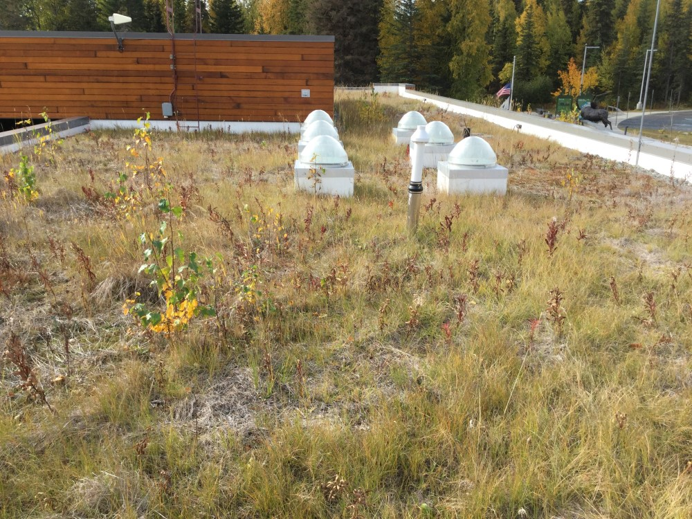

## Wednesday, September 23

To do:

* ~~Edit and submit this week's *Refuge Notebook* article.~~
* invasive species person nomination

I did some final editing on the snowshoe hare dataset and submitted it to the regional repository.

I edited and sent out this weeks' *Refuge Notebook* article.

I was given some earthworms collected a few days ago from Lower Copper Lake.

I formatted and posted the *Refuge Notebook* article from January 28.

Examining worm specimens from Lower Copper Lake given to me today. Pigmented red, setae widely spaced, clitellum on segments 25–31 or 26–31, tuburcula pubertatis on 28–30. This is *Bimastos rubidus*. I collected a tissue sample (BOLD-OI8).

Clif had asked me to inspect the roof of the visitor center for non-native plants, so I did so. The only non-native plant I saw up there were a few individuals of *Taraxacum officinale*.

I placed a yellow pan trap at the northeast corner of the lawn behind the headquarters building.

\
Plant community on the roof of the Kenai National Wildlife Refuge's visitor center.

One of the grasses from the roof I collected and identified as *Poa alpina*. In the spikelets were many amber-colored mites, some of which I collected (BOLD-6M6).
