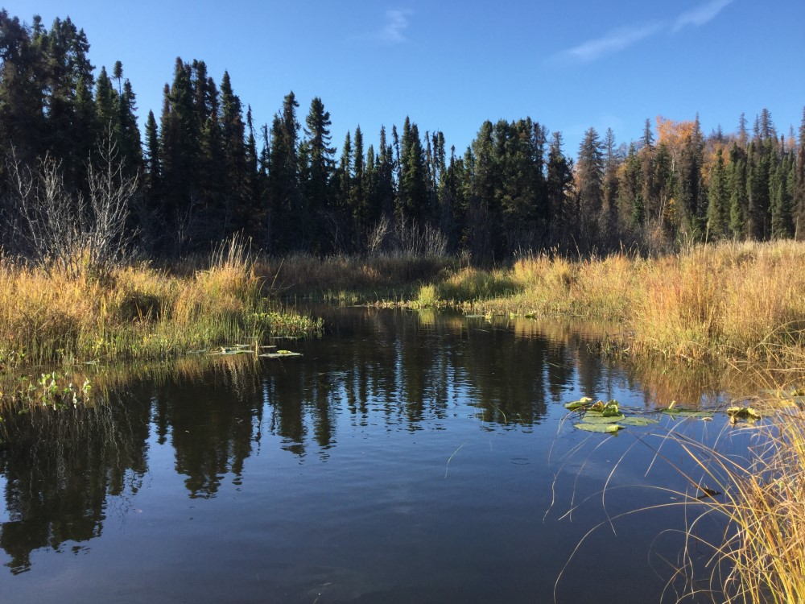
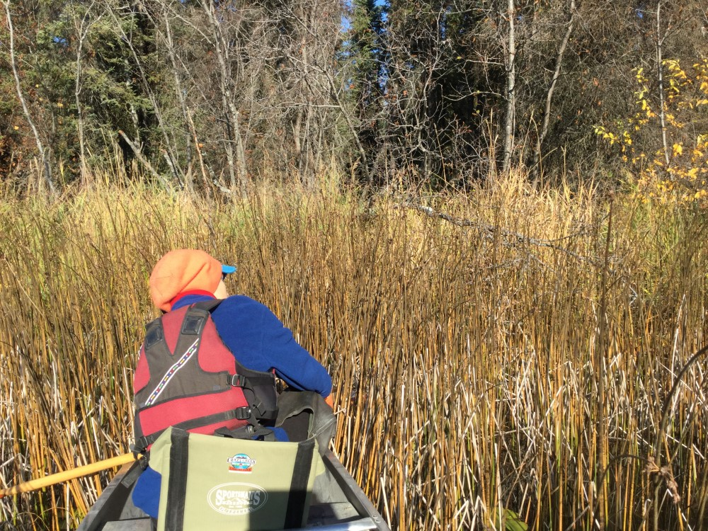

## Tuesday, October 6

Ethan and I put in at Canoe Lake #1 and paddled east along the north shoreline looking for reed canarygrass. We saw none until we reached the stream leading to Sucker Lake. Here we found a substantial patch of reed canarygrass along this stream. This started at 60.719017, -150.68670. We used Survey123 to document infestations.

There was quite a bit of reed canarygrass along the stream and in the grassy wetland all the way to the outlet at Sucker Lake at 60.720251, -150.684272.

\
Reed canarygrass in the stream flowing into Sucker Lake viewed from the inlet at Sucker Lake.

We turned left along the shore of Sucker Lake and found reed canarygrass on the shore at 60.722100, -150.683972 and at 60.723190, -150.681769.

\
One of many patches of reed canarygrass along the shore of Sucker Lake, this one behind rushes on the north shore just west of Sucker Creek.

There was reed canarygrass in Sucker Creek beginning at 60.723743, -150.679308. There were still many silver salmon in Sucker Creek and in Sucker Lake. They are dark and spawned out now.

We parked the canoe at the beaver dam and walked to the culvert at Swan Lake Road, where there was some reed canarygrass just upstream of the culvert at 60.724789, -150.678214.

Back at Sucker Lake we found more reed canarygrass along the shore at 60.720421, -150.677943 as we continued our paddle conterclockwise along the shore of the lake. 

This whole bay of the lake is infested, with patches from the point above to at least 60.719913, -150.675764. As we continued we found patches of reed canarygrass dotted all the way around the shore of Sucker Lake.

At Canoe Lake we paddled the shoreline counterclockwise. We did not paddle to the end of every bay of the lake, but we did paddle at least most of the way down each bay. There was no reed canarygrass near the portage to Waterfowl Lake. The only reed canarygrass we saw in Canoe Lake was at the portage to Canoe Lake #2 where Ben and I had seen it before.

