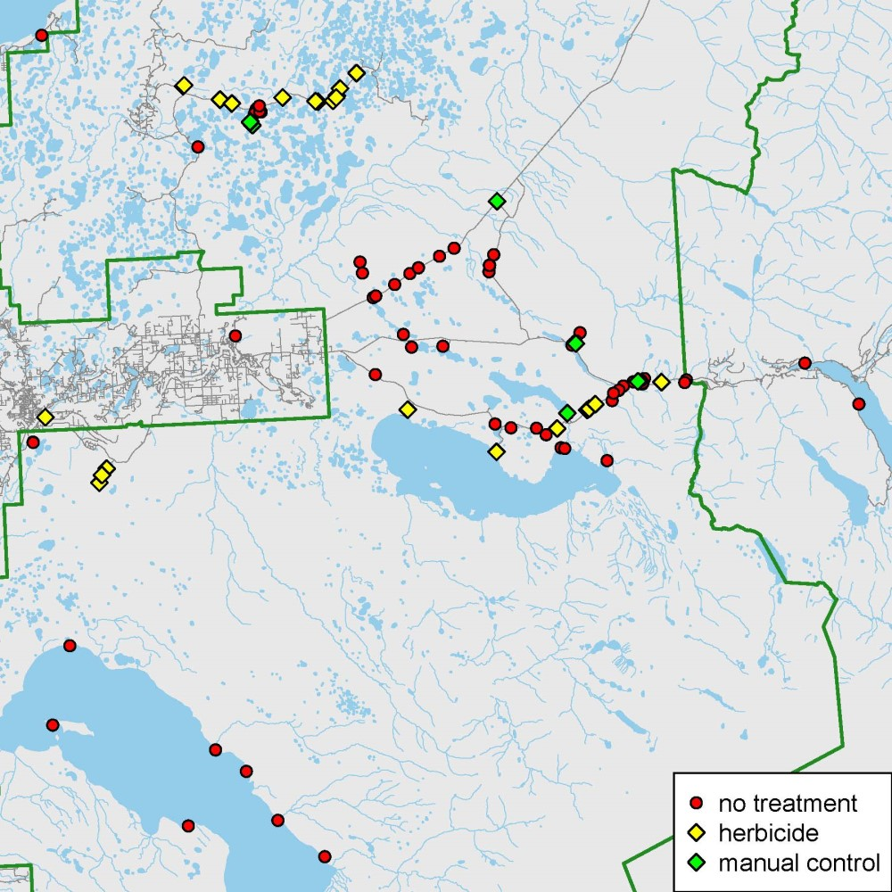

## Tuesday, October 13

To do

* Get weed management summaries to Mark.

```r
## R script to summarize non-native plant species and treatments.

## By Matt Bowser, 13.October.2020

library(maptools)
library(rgdal)
library(raster)
library(GISTools)

## Load data.
data03 <- read.csv("../data/final_data/observations/2020-10-07-1559_observations.csv",
 stringsAsFactors=FALSE
 )
 
data03$area_treat
## That is pretty clean.
data03$area_treat[is.na(data03$area_treat)] <- 0
data03$area_treat

data03$area_tre_1
## That is a mess.
## Cleaning up.
data03$area_tre_1 <- gsub(" acres", "", data03$area_tre_1)
data03$area_tre_1 <- gsub("1/2 acre", "0.5", data03$area_tre_1)
data03$area_tre_1 <- as.numeric(data03$area_tre_1)
data03$area_tre_1[is.na(data03$area_tre_1)] <- 0
data03$area_tre_1
data03$total_area_treated <- data03$area_treat + data03$area_tre_1

## How many acres were treated in all?
sum(data03$total_area_treated)
[1] 85.49

data03$control_ac 
 
ag1 <- aggregate(data03$total_area_treated, by=list(data03$control_ac), sum)
ag1 
                   Group.1     x
1      Broadcast Herbicide  0.50
2 Manual (pulling/digging)  0.00
3                     None  0.00
4                    Other  0.00
5           Spot Herbicide 84.99

## That is actually not quite right. There are no acreages for manual pulling or other. There should be.

data03$infested_a
## That needs cleaning up, too.
data03$infested_a <- gsub(" acres", "", data03$infested_a)
data03$infested_a <- gsub(" acre", "", data03$infested_a)
data03$infested_a <- as.numeric(data03$infested_a)
data03$infested_a[is.na(data03$infested_a)] <- 0
data03$infested_a

## Now filling in just missing values for non-herbicide control means.
sl <- data03$control_ac %in% c("Manual (pulling/digging)", "None", "Other")
data03$total_area_treated[sl] <- data03$infested_a[sl]

## Summarizing again.
ag1 <- aggregate(data03$total_area_treated, by=list(data03$control_ac), sum)
ag1

                   Group.1      x
1      Broadcast Herbicide  0.500
2 Manual (pulling/digging) 19.064
3                     None 61.331
4                    Other  0.001
5           Spot Herbicide 84.990

## Wow, that is a lot of manual work. What was that about?
data03[data03$control_ac=="Manual (pulling/digging)",]
 
## This is counting some treatments multiple times, too.
## This must be fixed for reporting.

data04 <- unique(data03[,c("globalid", "control_ac", "total_area_treated")])

## Try summarizing again.
ag1 <- aggregate(data04$total_area_treated, by=list(data04$control_ac), sum)
ag1
                   Group.1      x
1      Broadcast Herbicide  0.250
2 Manual (pulling/digging)  3.564
3                     None 36.801
4                    Other  0.001
5           Spot Herbicide 36.240
 
albers <- "+proj=aea +lat_1=55 +lat_2=65 +lat_0=50 +lon_0=-154 +x_0=0 +y_0=0 +ellps=GRS80 +datum=NAD83 +units=m +no_defs"
wgs84 <- "+proj=longlat +ellps=WGS84 +datum=WGS84 +no_defs"

## Fixing one GPS coordinate.
data03$longitude[which(grepl("cf4ad", data03$globalid))] <- -150.6913

## Save this here.
write.csv(data03, "../data/final_data/observations/2020-10-13-0844_observations.csv", row.names=FALSE)

coordinates(data03) <- c("longitude", "latitude")
proj4string(data03) <- CRS(wgs84)
dataab <- spTransform(data03, CRS(albers))

## Now map.
lakes <- readOGR(dsn="../source_data/geodata/KP_lakes/lakes.shp",
 stringsAsFactors=FALSE 
 )
 
streams <- readOGR(dsn="../source_data/geodata/KP_streams/streams.shp",
 stringsAsFactors=FALSE 
 )

roads <- readOGR(dsn="../source_data/geodata/Roads/roads.shp",
 stringsAsFactors=FALSE 
 )
 
ak <- readOGR(dsn="../source_data/geodata/Alaska/Alaska_coastline.shp")

knwr <- readOGR(dsn="../source_data/geodata/KNWR/knwr.shp") 

water <- "#93CCEA" 
land <- "#E8E8E8"
road <- "#888888"

pdf(file="../documents/2020-10-13_Survey123_data_map.pdf",
 width=6,
 height=6
 )
par(mar=rep(0,4))
par(bg=water)
plot(dataab,
 pch="",
 )
plot(ak,
 add=TRUE,
 col=land,
 border=water
 )
plot(streams,
 add=TRUE,
 col=water,
 lwd=0.5
 )
plot(lakes,
 add=TRUE,
 col=water,
 border=water
 )
plot(roads,
 add=TRUE,
 col=road,
 lwd=0.5
 )
plot(knwr,
 add=TRUE,
 border="forestgreen",
 lwd=2
 )
plot(dataab,
 add=TRUE,
 pch=21,
 bg="red"
 ) 
plot(dataab[dataab@data$control_ac %in% c("Broadcast Herbicide", "Spot Herbicide"),],
 add=TRUE,
 pch=23,
 bg="yellow",
 cex=1.2
 )  
plot(dataab[dataab@data$control_ac %in% c("Manual (pulling/digging)", "Other"),],
 add=TRUE,
 pch=23,
 bg="green",
 cex=1.2
 )  
legend("bottomright",
 legend=c("no treatment", "herbicide", "manual control"),
 pch=c(21, 23, 23),
 pt.bg=c("red", "yellow", "green"),
 pt.cex=c(1, 1.2, 1.2),
 bg="white"
 )
dev.off()
  
## Missing from this map are the big streams (Kenai River, etc.), so I should find a different streams/rivers shapefile. This map is good enough for now, though.
```

\
Map of weed survey data and treatments from Survey123 data.